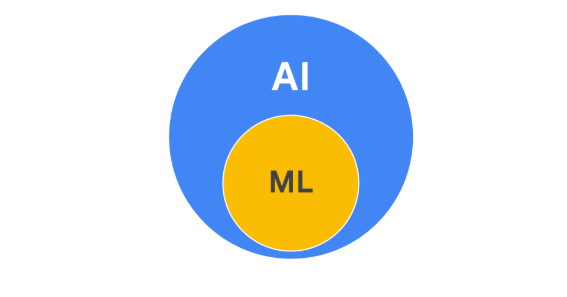
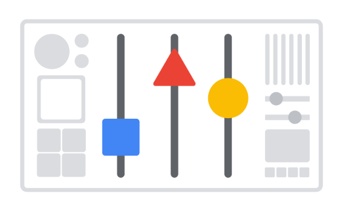
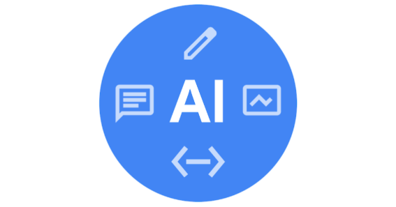

**Introdução ao curso Fundamentos de IA do Google**

Uma grande mudança está ocorrendo no local de trabalho moderno, e a IA está na vanguarda dessa essa transformação empolgante. Assim como a Internet mudou para sempre a maneira como realizamos as tarefas cotidianas, A IA tem o potencial para transformar a maneira como trabalhamos e vivemos. IA significa inteligência artificial. É uma solução prática para tornar as tarefas rotineiras menos demoradas. Aprender a usar a IA com eficácia em seu trabalho pode ajudar a atingir suas metas e preparar-se para o sucesso no cenário de trabalho em constante evolução. Por exemplo, considere um dia típico em seu trabalho. Se for parecido com o meu, você tem muitas tarefas para concluir. Em alguns dias, sua lista de tarefas pode parecer interminável, mas e se a IA pudesse ajudar? Por exemplo, em vez de gastar horas revisando planilhas, a IA pode ajudar você a analisar as informações em segundos. Ele também pode elaborar um relatório de vendas detalhado, destacando insights importantes para compartilhar com sua equipe. A IA pode agendar reuniões para você, criar apresentações engajadoras, aprimorar suas sessões de brainstorming e assumir uma variedade de outras tarefas que encurtará sua lista de tarefas. Se você tem curiosidade em aprender os conceitos básicos de IA, interesse em facilitar as tarefas rotineiras ou foco em aprimorar seu conjunto de habilidades. Criamos os Fundamentos de IA do Google para ajudar. Olá, meu nome é Maya e sou a vice-presidente de Estratégia e Operações no Google Research. Na minha função, lidero uma equipe que ajuda o Google a cumprir sua missão acelerando a pesquisa e promovendo um ambiente de pesquisa excepcional. Estou muito feliz por ser sua guia nessa jornada para explorar essa tecnologia que está remodelando o mundo dos negócios, a IA. Durante todo o curso, você terá a oportunidade de aprender com um grupo diversificado de especialistas em IA no Google, cuja função abrange do gerenciamento de programas aos diretores de produtos e serviços de IA. Cada um deles compartilhará suas percepções sobre IA e como isso pode elevar seu trabalho e avançar sua carreira. O curso Fundamentos da Inteligência Artificial do Google é projetado para se ajustar à sua agenda. Você pode concluí-lo em seu próprio ritmo, tudo on-line e não é necessário ter experiência prévia em IA. Este curso incluirá vídeos de funcionários do Google que trabalham com IA, textos para ajudar a aprofundar sua compreensão dos conceitos, e atividades interativas que proporcionam a você experiência prática de trabalho com IA. Ao fim do curso, você terá a oportunidade de para ganhar um distintivo de habilidade que pode ser exibido em seu currículo, perfis de mídia social e assinatura de e-mail. Se você é iniciante em IA, talvez tenha muitas perguntas sem resposta. Você pode se perguntar: "como posso usufruir das ferramentas de IA para aumentar minha produtividade? Como posso aplicar a IA de forma responsável no meu trabalho? Ou como devo me preparar para o futuro da IA no local de trabalho?" No curso Fundamentos de IA do Google, abordaremos cada uma dessas perguntas e muito mais. Espero que você esteja animado para se juntar a mim para descobrirmos como a IA pode melhorar sua carreira na vida. Tudo pronto? Vamos começar!

Olá e bem-vindo! O Google IA Essentials é um curso individualizado criado para profissionais de todas as funções e setores que desejam adquirir habilidades de IA sob demanda para turbinar seu conjunto de habilidades e melhorar sua produtividade. Não é necessário ter experiência prévia em inteligência artificial (IA).

Este curso é ministrado por especialistas em IA do Google que se dedicam a tornar a tecnologia útil para todos. Esses especialistas compartilharão seus conhecimentos e percepções com você à medida que você desvenda as aplicações práticas da IA no local de trabalho. Ao longo do curso, você ganhará uma valiosa experiência prática no uso de ferramentas de IA e descobrirá maneiras poderosas de a IA transformar seu fluxo de trabalho diário.

**Eleve suas habilidades**

A IA está transformando rapidamente o local de trabalho atual, portanto, desenvolver uma sólida compreensão da tecnologia pode lhe dar uma vantagem competitiva em vários setores. A IA também pode ajudar a tornar seus dias de trabalho mais produtivos e valiosos.

A IA generativa é uma forma específica de IA que se concentra na criação de novos conteúdos, como imagens, música, vídeo e texto, com base em exemplos nos quais foi treinada. Ao aprender a usar a IA generativa, você pode lidar com as tarefas rotineiras da sua lista de afazeres com mais eficiência, obter inspiração criativa quando se sentir travado, melhorar a qualidade do seu trabalho e dar vida às suas ideias.

**Evolução do curso**

O Google IA Essentials tem cinco módulos:

1. [\*\*Introdução à IA](https://www.coursera.org/learn/google-ai-essentials/home/module/1 "Link to Introduction of AI module")\*\* _(módulo atual_): Descubra como a IA funciona e explore os conceitos fundamentais da IA, como o aprendizado de máquina. Saiba mais sobre o surgimento da IA generativa e como realizar tarefas com ela. Ao final deste módulo, você terá uma compreensão dos recursos e das limitações das ferramentas de IA e de como integrar a IA generativa no local de trabalho.
1. [\*\*Maximize a produtividade com ferramentas de IA](https://www.coursera.org/learn/google-ai-essentials/home/module/2 "Maximize Productivity With AI Tools")**:**aproveite as ferramentas de IA generativa para acelerar as tarefas de trabalho e aumentar sua produtividade. Examine o importante papel que os seres humanos desempenham no uso eficaz da IA e entenda os tipos de tarefas no local de trabalho que você pode aumentar com a IA. Ao final deste módulo, você será capaz de determinar se a IA é adequada para uma determinada tarefa e como usá-la para acelerar os fluxos de trabalho.
1. [\*\*Descubra a arte de fazer prompts](https://www.coursera.org/learn/google-ai-essentials/home/module/3 "Link to Discover the Art of Prompting module")**:** Escreva prompts eficazes para obter o resultado que você deseja. Saiba como incorporar técnicas de prompting, como o prompting de poucos disparos, em seu trabalho. Entenda como as ferramentas de IA generativa produzem resultados e a importância de avaliar os resultados antes de usá-los. Ao final deste módulo, você será capaz de escrever prompts claros e específicos e produzir resultados que ajudem a realizar tarefas no local de trabalho.
1. [\*\*Usar a IA de forma responsável](https://www.coursera.org/learn/google-ai-essentials/home/module/4 "Link to Use AI Responsibly module")**:** Use a IA de forma responsável, mitigando vieses injustos e imprecisões. Aprenda a aplicar uma estrutura de danos de IA a exemplos de cenários no local de trabalho e a reconhecer os riscos de segurança do uso de IA no local de trabalho. Ao final deste módulo, você terá uma compreensão de como usar a IA de forma responsável e eficaz e uma lista de verificação para ajudá-lo a fazer isso.
1. [\*\*Fique à frente da curva da IA](https://www.coursera.org/learn/google-ai-essentials/home/module/5 "Link to Stay Ahead of the AI Curve module")**:** Continue desenvolvendo suas habilidades no cenário atual e emergente da IA. Conheça as maneiras como as organizações têm aproveitado a IA e considere como essas inovações podem inspirar suas próprias soluções de local de trabalho com IA. Ao final deste módulo, você desenvolverá uma estratégia para se manter atualizado com os futuros desenvolvimentos de IA.

**Conteúdo do curso**

Cada um dos cinco módulos deste curso oferece vários tipos de conteúdo, incluindo:

- **Vídeos** ministrados por especialistas em IA do Google que compartilham novos conceitos e orientações.
- **Leituras** para desenvolver os conceitos dos vídeos e apresentar novas ideias.
- **Atividades** para aplicar as habilidades que você está aprendendo e praticar o uso da IA.
- **Testes com notas** para medir seu progresso e fornecer feedback valioso. Se necessário, você pode responder a um teste avaliado várias vezes para obter uma pontuação de aprovação de 80% ou mais.

Após concluir este curso, você receberá um certificado do Google que poderá compartilhar nas redes sociais ou adicionar ao seu currículo!

**IA e o futuro do trabalho**

No mundo acelerado de hoje, a IA está se tornando rapidamente uma ferramenta padrão no kit de ferramentas de todas as empresas. Navegar pelo surgimento da IA no local de trabalho é como dirigir em uma rua movimentada. Assim como conhecer as regras de trânsito pode torná-lo um motorista e mais eficaz, entender os conceitos básicos da IA pode ajudar você a alcançar ao seu destino com segurança e evitar possíveis obstáculos. Para começar essa jornada de IA, vamos começar examinando o que o termo inteligência artificial realmente significa. Nesse contexto, a inteligência se refere à capacidade humana de executar tarefas cognitivas. Uma tarefa cognitiva é qualquer atividade mental como pensar, compreender, aprender e lembrar. Como seres humanos, temos habilidades cognitivas que nos permitem tomar decisões e resolver problemas. No entanto, também há limites sobre a quantidade de informações que podemos processar de cada vez. A IA é capaz de ampliar nossas habilidades cognitivas, nos ajudando a tomar melhores decisões e a resolver problemas mais rapidamente. Com esse entendimento, o termo inteligência artificial refere-se a programas de computador que podem realizar tarefas cognitivas normalmente associadas com a inteligência humana. Simplificando, os programas de IA podem nos ajudar nas tarefas usando a matemática para aprender com os dados. Como você descobrirá em breve, a IA tem o potencial de melhorar muito a qualidade das nossas vidas profissionais e otimizar as operações comerciais. No entanto, a IA não é uma solução mágica para todos os problemas de negócios. Como ocorre com qualquer ferramenta avançada, o segredo é usar a IA em seus pontos fortes e isso requer uma reflexão cuidadosa e consideração dos recursos da tecnologia. Você está curioso para descobrir como a IA funciona? Quer saber como a IA pode aprimorar seu trabalho? Então, prepare-se para explorar essas perguntas comigo e os Fundamentos de IA do Google.

**AI and the future of work**

In today's fast-paced world, AI is quickly becoming a standard tool in every company's toolkit. Navigating the emergence of AI in the workplace is similar to driving down a busy street. Just as knowing the rules of the road can make you a better and more effective driver, understanding the basics of AI can help you to reach your destination safely and to avoid potential roadblocks. To begin this AI journey, let's start by examining what the term artificial intelligence really means. In this context, intelligence refers to the human ability to perform cognitive tasks. A cognitive task is any mental activity such as thinking, understanding, learning, and remembering. As humans, we have cognitive abilities that allow us to make decisions and solve problems. However, there are also limits to how much information we can process at a time. AI is capable of extending our cognitive abilities, helping us to make better decisions and solve problems faster. With that understanding, the term artificial intelligence refers to computer programs that can complete cognitive tasks typically associated with human intelligence. Simply put, AI programs can assist us with tasks by using math to learn from data. As you'll soon discover, AI has the potential to greatly improve the quality of our work lives and streamline business operations. However, AI isn't a magic solution to every business problem. As with any advanced tool, the key is to use AI to its strengths, and doing so requires careful thought and consideration of the technology's capabilities. Are you curious to discover how AI works? Want to find out how AI can enhance your work? Then get ready to explore these questions with me and Google AI Essentials.

**Aprenda com as histórias de sucesso da IA**

- Em todos os setores, A IA está introduzindo novas abordagens de trabalho. Empresas e organizações de todos os tipos estão desenvolvendo soluções inovadoras para uma variedade de tarefas e desafios no local de trabalho, tudo com a ajuda da IA. Vamos explorar alguns exemplos de como a IA está reformulando a maneira como as pessoas trabalham em todo o mundo. Veja por exemplo a UKG, fornecedora de soluções de RH e de gerenciamento da força de trabalho. Ao integrar a IA ao seu conjunto de produtos, a UKG está melhorando a forma como os funcionários analisam as informações e os insights. Dessa forma, é mais fácil e mais rápido para os funcionários receberem respostas para suas perguntas relacionadas ao trabalho. A integração de IA da UKG também permite que os gerentes obtenham análises avançadas das interações dos usuários, ajudando-os a tomar decisões de negócios mais informadas. Agora, vamos considerar um dos setores mais antigos no mundo, a agricultura. A IA também está sendo usada para enfrentar muitos desafios nesse setor. Por exemplo, um desafio comum que os agricultores rurais enfrentam todos os anos é a incerteza econômica devido a uma variedade de fatores. Uma delas são as mudanças frequentes com colheitas e produção de gado. Outros fatores incluem condições climáticas imprevisíveis e acesso limitado a técnicas agrícolas avançadas.

Incertezas como essas podem dificultar a vida dos agricultores para tomar decisões comerciais eficazes. A Jiva é uma empresa agrícola focada em ajudar os agricultores rurais a resolver esses tipos de desafios. Como parte de sua missão, a Jiva fornece soluções de IA às comunidades agrícolas que podem ajudá-los a alcançar a sustentabilidade e práticas agrícolas confiáveis. A Jiva usa ferramentas de IA que podem diagnosticar pragas agrícolas e sugerir soluções. Os agricultores também podem receber conselhos relevantes baseados em IA que os ajudam a produzir colheitas de melhor qualidade e aumentar a produtividade. Com a ajuda da IA, a Jiva ajuda os agricultores a se manterem informados e acessarem mais insights que podem melhorar seus negócios. Em geral, a IA pode ser uma ferramenta poderosa para todos os tipos de atividades comerciais. E não importa o setor, a IA tem o potencial de transformar a forma como as empresas e as organizações desenvolvem inovações, inovadoras com visão de futuro. À medida que você continua sua jornada no mundo da IA, pense no seguinte. De que forma a IA pode impactar positivamente seu setor e como você pode fazer parte dessa mudança?

**Learn from AI success stories**

Across every industry, AI is introducing new approaches to work. Companies and organizations of every type are developing innovative solutions to a variety of workplace tasks and challenges, all with the help of AI. Let's explore some examples of how AI is reshaping the way people work all across the globe. Consider UKG, a provider of HR and workforce management solutions. By integrating AI into its product suite, UKG is improving how its employees analyze information and insights. This can make it easier and faster for employees to receive answers to their work-related questions. UKG's AI integration also enables managers to gain advanced analytics from user interactions, helping them make more informed business decisions. Now, let's consider one of the oldest industries in the world, farming. AI is also being used to address many challenges in this industry. For example, a common challenge that rural farmers face each year is economic uncertainty due to a variety of factors. One is frequent changes with crop and livestock yields. Other factors include unpredictable weather conditions and limited access to advanced farming techniques.

Uncertainties like these can make it difficult for farmers to make effective business decisions. Jiva is an agricultural company focused on helping rural farmers solve these types of challenges. As part of their mission, Jiva provides farming communities with AI solutions that can assist them in achieving sustainable and reliable farming practices. Jiva uses AI tools that can diagnose crop diseases and suggest remedies. Farmers can also receive relevant AI-powered advice that helps them produce better quality crops and increase yields. With the help of AI, Jiva helps rural farmers stay informed and access more insights that can improve their business. Overall, AI can be a powerful tool for all kinds of business activities. And no matter the industry, AI has the potential to transform how companies and organizations develop innovative, forward-thinking solutions. As you continue your journey into the world of AI, consider this. In what ways can AI positively impact your industry, and how can you be part of that change?

**Maya: O empolgante mundo da IA**

\- Sou Maya, sou vice-presidente de estratégia e operações do Google Research. No dia a dia, o Google Research está tentando descobrir quais são as coisas que podem mudar a sociedade e nossos negócios hoje, amanhã e no futuro. Começamos dizendo, você sabe, o que é impossível na mente das pessoas? Quais são os problemas que precisam ser resolvidos? E como podemos aplicar a experiência que temos a esses problemas para fornecer uma solução que beneficie a todos nós como pessoas e também nossos negócios? Uma peça de tecnologia do Google Research da qual temos muito orgulho, neste momento, porque muitas que utilizamos IA no passado, está em torno de trilhos, que é quando você olha para o céu e vê a trilha branca por trás de um jato. E utilizando a IA para tentar entender como podemos aliviar isso, pois ela tem um impacto muito negativo no clima. Atualmente, a maioria das tecnologias tem um componente de IA ou uma adjacência à IA. Tenho muita esperança de que as ferramentas de IA tenham um impacto tremendo de forma positiva sobre nós como pessoas. Acho que estamos apenas no começo dessa jornada. A IA é uma ferramenta que eu considero poderosa

para alcançar o propósito da minha vida, que é aliviar o sofrimento e nos ajudar a progredir como pessoas para um lugar melhor, para ter uma sociedade melhor, ter um mundo melhor. Não é algo que não seja acessível e pelo qual as pessoas precisem se intimidar. Somos todos bem-vindos nesta jornada.

**Maya: The exciting world of AI**

I'm Maya, I'm Vice President of Strategy and Operations at Google Research. Day to day, Google Research is trying to figure out what are the things that can change society and our business today, tomorrow, and in the future. We start by saying, you know, what's impossible in people's minds? What are problems that need to be solved? And how can we apply the expertise that we have to those problems to provide a solution that benefits all of us as people and also our business? One piece of technology at Google Research we're very proud of, at this moment because there's so many that we've had in the past that utilize AI, is around contrails, which is when you look up at the sky and you see the white trail from behind a jet. And utilizing AI to try to understand how can we alleviate that because it has a very negative impact on climate. Most technologies nowadays have either an AI component or an adjacency to AI. I'm very hopeful that AI tools will have a tremendous impact in a positive way on us as people. I think that we're just at the beginning of that journey. AI is one tool that I consider a powerful one in achieving my life's purpose, which is to alleviate suffering and to help us progress as people to a better place, to have a better society, have a better world. It's not something that's not approachable and something that people need to be intimidated by.

We are all welcome on this journey.

**Glossário**

Este curso apresenta muitos termos e conceitos, que estão incluídos no [glossárioFundamentos de IA do Google](https://www.coursera.org/learn/google-ai-essentials/resources/A68dK) para ajudar a apoiar seu aprendizado.

**Explore como a IA usa o aprendizado de máquina**

Todo o burburinho em torno da IA pode fazer com que ela pareça a a mais nova tendência tecnológica. Mas a verdade é que a IA já existe há algum tempo. Por exemplo, você já se perguntou como as plataformas de streaming recomendam vídeos que você possa gostar? Esse recurso é oferecido a você pela IA. Durante anos, as plataformas de streaming têm usado ferramentas de IA para oferecer serviços como sistemas de recomendação que aprimoram a experiência do usuário. Uma ferramenta de IA refere-se a um software com tecnologia de IA que pode automatizar ou auxiliar os usuários em uma variedade de tarefas. Há exemplos de ferramentas de IA em toda parte, de sistemas de GPS que sugerem rotas rápidas a sistemas de tradução que interpretam as conversas em tempo real. Empresas de todos os tipos e tamanhos usam ferramentas de IA para otimizar as operações e melhorar a qualidade de seus produtos e serviços. Embora essas ferramentas de IA possam parecer naturalmente inteligentes, é importante reconhecer que elas não são autodidatas. Em vez disso, elas são alimentadas pelo que é conhecido como aprendizado de máquina. O aprendizado de máquina, ou ML, é um subconjunto da IA focado no desenvolvimento de programas de computador que podem analisar dados para tomar decisões ou fazer previsões. O ML é uma camada especializada dentro da categoria mais ampla de tecnologia de IA. Ele é frequentemente usado por ferramentas de IA para dar sentido aos dados de forma rápida e eficiente. Os projetistas de IA criam programas de ML usando um conjunto de treinamento, que é uma coleção de dados usados para ensinar IA. Basicamente, os conjuntos de treinamento fornecem programas de ML com exemplos do que esperar e como responder adequadamente. Por exemplo, considere um distribuidor de alimentos que usa uma ferramenta de IA para classificar e embalar maçãs maduras em sua fábrica. Para que essa ferramenta funcione, um designer de IA deve primeiro treinar um programa de ML para identificar maçãs maduras. Eles fariam isso fornecendo ao seu programa de ML um conjunto de treinamento que inclui milhares de imagens de maçãs maduras e não maduras. À medida que o programa de ML processa essas imagens, ele acaba aprendendo a identificar as características das maçãs maduras. Tendo aprendido a fazer isso com o ML, a ferramenta de IA pode então identificar maçãs maduras que não estavam em seu conjunto de treinamento e ajudar os funcionários da fábrica a trabalhar com mais eficiência. Como mencionei anteriormente, muitas ferramentas de IA usam o ML para aprender e melhorar seu desempenho. No entanto, para que os programas de ML tenham um desempenho eficaz, a qualidade e a relevância de seus dados de treinamento importam. Uma questão fundamental a ser considerada é o potencial de viés nos dados de treinamento. Isso pode, de forma não intencional, fazer com que uma ferramenta de IA produza resultados imprecisos ou não intencionais. Por exemplo, a ferramenta de IA que foi usada para classificar maçãs maduras pode ter aprendido com os dados de treinamento que contêm apenas imagens de tipos específicos de maçãs vermelhas. Isso tornaria involuntariamente a IA menos precisa na identificação de maçãs maduras de tamanhos, formas ou cores variadas. O produtor de alimentos pode acabar classificando as maçãs incorretamente, fazendo com que eles percam dinheiro e desperdiçando maçãs perfeitamente boas. Quando usado adequadamente, o ML cumpre uma função-chave no avanço da IA para o futuro. É realmente uma técnica incrível e sofisticada com inúmeras aplicações.

**Explore how AI uses machine learning**

All the buzz surrounding AI can make it seem like the hottest new tech trend. But the truth is, AI has been around for a while. For example, have you ever wondered how streaming platforms recommend videos you might like? This feature is brought to you by AI. For years, streaming platforms have used AI tools to offer services like recommendation systems that enhance the user experience. An AI tool refers to AI-powered software that can automate or assist users with a variety of tasks. Examples of AI tools are everywhere, from GPS systems that suggest quick routes to translation systems that interpret conversations in real time. Companies of all shapes and sizes use AI tools to streamline operations and improve the quality of their products and services. While these AI tools can seem naturally smart, it's important to recognize that they're not self-taught. Instead, they're powered by what's known as machine learning. Machine learning, or ML, is a subset of AI focused on developing computer programs that can analyze data to make decisions or predictions. ML is a specialized layer under the broader category of AI technology. It's often used by AI tools to make sense of data quickly and efficiently. AI designers build ML programs using a training set, which is a collection of data used to teach AI. Basically, training sets provide ML programs with examples of what to expect and how to respond appropriately. For example, consider a food distributor that uses an AI tool to sort and pack ripe apples in their factory. For this tool to work, an AI designer must first train an ML program to identify ripe apples. They would do this by providing their ML program with a training set that includes thousands of images of ripe and unripe apples. As the ML program processes these images, it eventually learns to identify the features of ripe apples. Having learned to do this with ML, the AI tool can then identify ripe apples that weren't in its training set and help factory employees work more efficiently. As I mentioned earlier, many AI tools use ML to learn and improve their performance. However, for ML programs to perform effectively, the quality and relevance of their training data matter. A fundamental issue to be aware of is the potential for bias within training data. This could unintentionally cause an AI tool to produce inaccurate or unintended outputs. For example, the AI tool that was used to sort ripe apples might have learned from training data that only contain images of specific types of red apples. This would unintentionally make the AI less accurate at identifying ripe apples of varying sizes, shapes, or colors. The food producer might end up sorting apples incorrectly, causing them to lose money and waste perfectly good apples. When used appropriately, ML plays a key role in advancing AI into the future. It's truly an incredible and sophisticated technique

**Fundamentos da IA generativa**

Os avanços na tecnologia de IA estão reformulando a forma como trabalhamos. Vamos explorar um dos desenvolvimentos-chave no centro dessa transformação: a IA generativa. Como o nome sugere, a IA generativa é a IA que pode gerar novos conteúdos como texto, imagens ou outras mídias. Uma qualidade única das ferramentas de IA generativa é que você pode usá-las com a linguagem natural. A linguagem natural refere-se à maneira como as pessoas falam ou escrevem quando se comunicam. Aqui está uma visão geral simplificada de como uma ferramenta de IA generativa funciona com a linguagem natural. Primeiro, você fornece a entrada. Entrada refere-se a qualquer informação ou dado que é enviado a um computador para processamento. Muitas ferramentas de IA generativa aceitam a entrada de texto e fala e alguns também aceitam imagens ou arquivos de vídeo. Em seguida, os dados são processados pela ferramenta de IA. Por fim, um resultado é gerado no formato de texto, imagens, áudio ou vídeo. A IA generativa e a capacidade de interagir com computadores usando a linguagem natural introduziram um mundo de possibilidades em relação ao que as pessoas podem criar com a IA. Por exemplo, quando você faz o marketing para um novo negócio. Você precisa de um conteúdo novo e envolvente, como um pôster promocional para anunciar um novo produto, mas não tem uma equipe de criação para dar vida às suas ideias. Não precisa se estressar. Com algumas instruções, a IA generativa pode ajudar você a criar um pôster. Se o conteúdo gerado não atender às suas expectativas, você pode fornecer instruções adicionais até que ele produza algo que atenda às suas necessidades. Este é apenas um exemplo de como a IA generativa pode complementar suas habilidades, mas há muitas outras maneiras pelas quais ela pode beneficiar você e seu trabalho. Por exemplo, a IA generativa pode aumentar sua produtividade ajudando em tarefas como redigir respostas a e-mails. Isso pode ajudar você a evitar erros e pode melhorar seu processo de tomada de decisões, ao responder a perguntas e fazer um brainstorming de ideias com você. Se você trabalha no setor de saúde, educação, finanças, varejo, ou em qualquer outro campo, há uma grande variedade de ferramentas de IA generativa que podem atender às suas necessidades. Um exemplo é uma ferramenta de IA conversacional. Uma ferramenta de IA conversacional é uma ferramenta de IA generativa que processa solicitações de texto e gera respostas de texto. Você pode usá-la para fazer um brainstorming de ideias, responder a perguntas e aumentar sua produtividade. Por meio do Fundamentos de IA do Google, você adquire experiência prática usando uma ferramenta de IA conversacional ferramenta da Google chamada Gemini. O Gemini pode ser usado para obter inspiração criativa quando você estiver com algum bloqueio, desenvolver suas ideias e fornecer explicações detalhadas que ajudam a explorar os tópicos com facilidade. Por exemplo, vamos pedir ao Gemini para fazer um brainstorming de uma lista de atividades de união de equipes para nosso retiro de trabalho no verão. A ferramenta de IA responde com uma ampla gama de ideias desde uma divertida festa na praia até uma aula descontraída de cerâmica. O Gemini também compartilhou algumas dicas adicionais para considerar ao planejar um retiro de trabalho bem-sucedido. A IA generativa abriu os caminhos para novas e empolgantes fronteiras, mas antes de podermos aproveitar o que essa tecnologia tem a oferecer, é essencial investigar os recursos e limitações da IA como um todo. Continue na próxima parte desta lição para começar.

**Fundamentals of Generative AI**

Advancements in AI technology are reshaping how we work. Let's explore one of the key developments at the center of this transformation, generative AI. As the name suggests, generative AI is AI that can generate new content such as text, images, or other media. A unique quality of generative AI tools is that you can use them with natural language. Natural language refers to the way people talk or write when communicating with each other. Here's a simplified overview of how a generative AI tool works with natural language. First, you provide input. Input refers to any information or data that's sent to a computer for processing. Many generative AI tools, accept text and speeches input, and some also accept images or video files. Next, the data is processed by the AI tool. Then an output is generated in the form of text, images, audio, or video. Generative AI and the ability to interact with computers using natural language has introduced a world of possibilities for what people can create with AI. For example, you might be marketing a new business. You need fresh, engaging content like a promotional poster to advertise a new product, but you don't have a creative team to bring your ideas to life. No need to stress. With a few instructions, generative AI can help you create a poster. If the generated content doesn't meet your expectations, you can provide additional instructions until it produces something that meets your needs. This is just one example of how generative AI can complement your skills, but there are many other ways it can benefit you and your work. For example, generative AI can boost your productivity by helping you with tasks like drafting replies to emails. It can help you avoid mistakes, and it can improve your decision-making process by answering questions and brainstorming ideas with you. Whether you work in healthcare, education, finance, retail, or any other field, there are a wide variety of generative AI tools that can cater to your needs. One example is a conversational AI tool. A conversational AI tool is a generative AI tool that processes text requests and generates text responses. You can use it to brainstorm ideas, answer questions, and boost your productivity. Throughout Google AI Essentials, you'll gain practical experience using a conversational AI tool by Google called Gemini. Gemini can be used to get some creative inspiration when you're feeling stuck, build on your ideas, and provide detailed explanations that help you explore topics easily. For example, let's ask Gemini to brainstorm a list of team-bonding activities for our summer work retreat. The AI tool responds with a wide range of ideas from a fun beach party to a relaxed pottery class. Gemini also share some additional tips to consider when planning a successful work retreat. Generative AI has paved the way to exciting new frontiers, but before we can tap into what this technology has to offer, it's essential to investigate the capabilities and limitations of AI as a whole. Continue to the next part of this lesson to get started.

**Um guia para IA e ML**

A Inteligência Artificial (IA) e o Aprendizado de Máquina (AM) estão mudando o futuro do trabalho. Embora os dois termos pareçam semelhantes, o aprendizado de máquina é, na verdade, uma técnica específica usada pelos projetistas de IA para obter programas de computador com inteligência artificial. Conhecer os conceitos básicos de como a IA e o ML se relacionam pode ajudá-lo a navegar por essas tecnologias à medida que elas transformam o cenário de trabalho, permitindo que você contribua efetivamente para projetos orientados por IA ou lidere suas próprias iniciativas de IA.

Nesta leitura, você explorará algumas das técnicas de AM que os designers de IA usam para criar programas de IA, aprofundando sua compreensão de como o AM aproveita os dados para tomar decisões e executar tarefas. Você também explorará como as técnicas de AM prepararam o caminho para a IA generativa.

**Técnicas de desenvolvimento de IA**

**Inteligência Artificial** refere-se a programas de computadores que podem realizar tarefas cognitivas normalmente associadas à inteligência humana. Há duas técnicas principais usadas para projetar programas de IA:

- **As técnicas baseadas em regras** envolvem a criação de programas de IA que seguem estritamente regras predefinidas para tomar decisões. Por exemplo, um filtro de spam que usa técnicas baseadas em regras pode bloquear e-mails que contenham palavras-chave específicas usando sua lógica predefinida.
- **As técnicas de aprendizado de máquina** envolvem a criação de programas de IA que podem analisar e aprender com padrões nos dados para tomar decisões independentes. Por exemplo, um filtro de spam que usa essas técnicas pode sinalizar possíveis spams para o destinatário revisar, evitando o bloqueio automático. Se o destinatário marcar e-mails de fontes confiáveis como seguros, o filtro de spam aprende e adapta sua lógica para incluir e-mails semelhantes desse remetente no futuro.

As ferramentas de IA podem usar técnicas baseadas em regras ou de ML, ou até mesmo uma combinação de ambas. Em geral, as técnicas baseadas em regras são comumente usadas para tarefas que exigem rigidez, como o bloqueio de mensagens de remetentes não confiáveis que são obviamente spam, como solicitações de transferências bancárias ou informações privadas. Por outro lado, as técnicas de AM são mais adequadas para tarefas que exigem flexibilidade e adaptabilidade, como aprender a reconhecer que as mensagens de remetentes confiáveis que contêm erros de digitação não são spam.

**Abordagens para treinamento de programas de ML**

Lembre-se de que **o aprendizado de máquina** é um subconjunto da IA voltado para o desenvolvimento de programas de computadores que podem analisar dados para tomar decisões ou fazer previsões. Os projetistas de IA geralmente usam o ML em seus programas de IA porque ele não tem as limitações das técnicas baseadas em regras.

Há três abordagens comuns para o treinamento de programas de AM:

- Aprendizagem supervisionada
- Aprendizagem não supervisionada
- Aprendizagem por reforço

**Aprendizagem supervisionada**

Nessa abordagem, o programa de AM aprende com um conjunto de treinamento _rotulado_. Um Conjunto de treinamento rotulado inclui dados rotulados ou etiquetados, que fornecem contexto e significado aos dados. Por exemplo, um filtro de spam de e-mail treinado com aprendizagem supervisionada usaria um conjunto de treinamento de e-mails rotulados como _"spam"_ ou _"não spam"_ A aprendizagem supervisionada é frequentemente usada quando se tem em mente um resultado específico*.*

**Aprendizagem não supervisionada**

Nessa abordagem, o programa de AM aprende com um conjunto de treinamento _não rotulado_. Um Conjunto de treinamento não rotulado inclui dados que não têm rótulos ou etiquetas. Por exemplo, o AM pode ser usado para analisar um conjunto de dados de mensagens de e-mail não classificadas e encontrar padrões em tópicos, palavras-chave ou contatos. Em outras palavras, a Aprendizagem não supervisionada é usada para identificar padrões nos dados sem um resultado específico em mente.

**Aprendizagem por reforço**

Nessa abordagem, o programa de AM usa tentativa e erro para aprender quais ações levam ao melhor resultado. O programa aprende a fazer isso ao ser recompensado por fazer boas escolhas que levam aos resultados desejados. A aprendizagem por reforço é comumente usada por ferramentas de IA de conversação. À medida que essas ferramentas recebem feedback dos usuários e dos designers de IA, elas aprendem a gerar respostas eficazes.

Cada técnica de ML tem seus próprios pontos fortes e fracos. Dependendo do tipo de dados disponíveis e do que é necessário para resolver o problema específico, os designers de IA podem usar uma, duas ou todas as três técnicas para produzir uma solução alimentada por IA.

**IA generativa**

Os avanços na Aprendizagem supervisionada, não supervisionada e por reforço ajudaram a pavimentar o caminho para a **IA generativa - IA**que pode gerar novo conteúdo, como texto, imagens ou outras mídias. Quando os usuários fornecem dados na forma de um **prompt -**dados **de texto**que fornecem instruções ao modelo de IA sobre como gerar resultados -, a ferramenta de IA processa esses dados para gerar novo conteúdo.

Por exemplo, todas as três abordagens desempenham funções distintas nas ferramentas de IA para conversação. A Aprendizagem supervisionada equipa as ferramentas de IA para conversação com dados fundamentais de diálogo, permitindo que elas respondam adequadamente às dicas comuns de conversação. A Aprendizagem não supervisionada permite que elas interpretem nuances na linguagem, como coloquialismos, que ocorrem naturalmente em uma conversa. A Aprendizagem por reforço fortalece ainda mais essas ferramentas, permitindo que elas melhorem suas respostas em tempo real com base no feedback do usuário. Isso permite que elas se adaptem ao contexto da conversa e se envolvam em conversas naturais.

A capacidade da IA generativa de criar e inovar oferece uma série de benefícios para todos os tipos de locais de trabalho e profissões, como marketing, desenvolvimento de produtos, engenharia, educação, manufatura e pesquisa e desenvolvimento. Esses benefícios incluem:

- **Maior eficiência:** A IA generativa pode automatizar ou aumentar as tarefas de rotina, permitindo que os funcionários se concentrem em outras prioridades de trabalho.
- **Experiências personalizadas:** A IA generativa pode adaptar suas interações às preferências e necessidades individuais.
- **Melhores decisões:** A IA generativa pode analisar rapidamente grandes quantidades de dados para descobrir insights úteis.

Essas são apenas algumas das maneiras pelas quais a IA generativa pode aprimorar seu trabalho.

**Para obter mais informações**

[O PAIR Explorables](https://pair.withgoogle.com/explorables/) é um recurso opcional para quem deseja aprender mais sobre IA. Trata-se de uma coleção de artigos interativos projetados para tornar os principais conceitos de IA mais acessíveis e compreensíveis. O PAIR Explorables abrange uma ampla gama de tópicos, incluindo:

- Noções básicas de Aprendizado de máquina
- Equidade e preconceito em programas de IA
- Considerações sobre dados e privacidade em IA
- Riscos e benefícios potenciais da IA

Cada artigo apresenta visualizações e controles interativos que podem ajudá-lo a explorar diferentes conceitos de IA e experimentar como eles funcionam.

**Compreenda os recursos e as limitações da IA**

Just as you don't need to be a carpenter to use a hammer, you don't need to be a computer expert to use AI effectively. That said, understanding the basics of what AI can do will help you make the most of the technology. Today's AI tools can do a lot to enhance your work. They can generate content, like assisting a marketing team by making a promotional video for a new product. They can analyze information quickly, like highlighting the key points of a long email thread. They can answer questions in a detailed and nuanced way. And overall, they can simplify your day-to-day and allow you to focus on other aspects of your work. While AI can complete a variety of tasks, there are some tasks that require a human touch, such as handling sensitive issues. These limitations can be critical in certain contexts. For example, AI can't learn independently. It needs people to continually update its training. Shortcomings in an AI tool's training data can also potentially reflect or amplify biases, leading to skewed or unfair outcomes. Another major limitation is that AI output can sometimes contain inaccuracies, otherwise known as hallucinations. Hallucinations are AI outputs that are not true. These inaccuracies can range from minor errors, such as a sentence that doesn't make sense, to significant distortions. For instance, consider a sales manager who's using an AI tool to analyze quarterly sales data. The AI tool might identify declining sales of a particular product, and flag the item as something that should be removed from stores. However, what if there were a seasonal factor affecting sales that hadn't been accounted for in the AI tool's analysis? Hallucinations like this one can lead to misguided decisions if the user doesn't carefully review the AI tool's output. Considering AI's limitations, human oversight over AI generated output is crucial to ensure that the information is accurate and ethical. Effective management of AI in the workplace requires teamwork from technical to non-technical roles to ensure that AI's output and decision making processes are aligned with values that benefit people. Ultimately, an inclusive approach that maintains human oversight over these tools is the key to shaping a brighter future where AI works for everyone.

**Understand the capabilities and limitations of AI**

Assim como você não precisa ser um carpinteiro para usar um martelo, você não precisa ser um especialista em computadores para usar a IA de forma eficaz. Dito isso, entender os princípios básicos do que a IA pode fazer ajudará você a aproveitar ao máximo a tecnologia. As ferramentas de IA atuais podem fazer muito para aprimorar seu trabalho. Elas podem gerar conteúdo, como auxiliar uma equipe de marketing ao fazer um vídeo promocional para um novo produto. Elas podem analisar as informações rapidamente, como destacar os principais pontos de uma longa discussão por e-mail. Podem responder a perguntas em detalhes e com nuances. E, em geral, podem simplificar seu dia a dia e permitir que você se concentre em outros aspectos de seu trabalho. Embora a IA possa realizar uma variedade de tarefas, há algumas tarefas que exigem um toque humano, como lidar com questões delicadas. Essas limitações podem ser críticas em determinados contextos. Por exemplo, a IA não pode aprender de forma independente. Ela precisa de pessoas para atualizar continuamente seu treinamento. As deficiências nos dados de treinamento de uma ferramenta de IA também podem potencialmente refletir ou ampliar os vieses, levando a desfechos distorcidos ou injustos. Outra grande limitação é que o resultado da IA pode, às vezes, conter imprecisões, também conhecidas como alucinações. As alucinações são resultados de IA que não são verdadeiros. Essas imprecisões podem variar de pequenos erros, como uma frase que não faz sentido, a distorções significativas. Por exemplo, considere um gerente de vendas que está usando uma ferramenta de IA para analisar dados de vendas trimestrais. A ferramenta de IA pode identificar vendas em declínio de um determinado produto e sinalizar o item como algo que deve ser removido das lojas. No entanto, e se houvesse um fator sazonal afetando as vendas que não foi contabilizado na análise da ferramenta de IA? Alucinações como essa podem levar a decisões equivocadas se o usuário não analisar com atenção o resultado da ferramenta de IA. Considerando as limitações da IA, a supervisão humana sobre os resultados gerados pela IA é crucial para garantir que as informações sejam precisas e éticas. Gerenciamento eficaz da IA no local de trabalho requer trabalho em equipe entre funções técnicas e não técnicas para garantir que os resultados da IA e os processos de tomada de decisão estejam alinhados com valores que beneficiam as pessoas. Em última análise, uma abordagem inclusiva que mantém a supervisão humana dessas ferramentas é a chave para moldar um futuro mais brilhante no qual a IA funciona para todos.

**Vint: Use a IA para mudanças positivas**

Olá, eu sou Vint, vice-presidente e evangelista-chefe da Internet do Google. Algumas pessoas me consideram famoso. Eu não. Eu me considero uma pessoa de sorte. Eu tive a sorte de ser uma das pessoas que iniciou o projeto da Internet em 1973. E, desde aquela época, toda a minha carreira vem sendo muito relacionada à Internet e sua evolução. Então, as pessoas me perguntam o que é um evangelista-chefe da Internet e por que a Internet precisa de um evangelista? E a resposta para isso é que apenas cerca de dois terços da população mundial estão realmente on-line e podem acessar todos os tesouros e riquezas da Internet. E assim, o evangelista-chefe da Internet ainda está rodando pelo mundo, incentivando as pessoas a desenvolverem mais a Internet para que todos possam ter acesso. Eu já participei do espaço de IA durante quase toda a sua existência porque a noção de inteligência artificial remonta à década de 1960. Então, vamos falar um pouco sobre a maneira como a IA pode ser usada em situações de crise, como incêndios florestais e coisas do gênero. Em nove países diferentes, os serviços do Google estão sendo usados, os Alertas SOS, para detectar e alertar geograficamente sobre incêndios florestais. Portanto, estamos começando a ver a matéria-prima indo para os algoritmos de inteligência artificial para nos ajudar a prever o que o que um incêndio vai fazer. E isso ajudará as equipes de resposta a incêndios florestais e certamente ajudará a tirar as pessoas dos edifícios se eles estiverem, de fato, em risco. Outro exemplo vem de uma de nossas organizações irmãs, a DeepMind, que treinou um sistema de aprendizado de máquina para aprender a enovelar proteínas que são geradas pela interpretação do DNA. E o motivo pelo qual isso é tão importante é que essas moléculas podem vir a ser a chave para solucionar vários tipos de doenças genéticas. Quero dizer, fico muito empolgado com coisas desse tipo. A educação de IA não se trata dos detalhes, na verdade, como ela funciona exatamente? Nem todos precisam saber como um carro é construído para usá-lo. Queremos que as pessoas tenham um senso consciente do poder e do perigo da inteligência artificial. Acho que, em longo prazo, à medida que aprendemos a usar essas técnicas cada vez melhor e de forma mais confiável, haverá um impacto radical em quase todos os setores da vida. Isso aumentará nossa capacidade de fazer pesquisas. Todo aluno poderá ter um tutor pessoal, de fato. Pessoas criativas, que estão tentando criar textos e filmes, vídeos e imagens, terão uma paleta e uma ferramenta muito mais capaz do que um pincel para inventar e criar. E assim, da mesma forma que a web mundial acabou se tornando uma plataforma tão grande para criatividade e inovação, Acho que o mundo da IA induzirá um tipo de efeito semelhante.

**Vint: Use AI for Positive Change**

- Hi, I'm Vint, vice president and chief internet evangelist at Google. Some people think of me as famous. I don't. I think of me as lucky. I had the good fortune of being the one of the people who started the design of the internet in 1973. And since that time, my entire career has been strongly related to internet and its evolution. So people ask me, what is a chief internet evangelist and why does the internet need an evangelist at all? And the answer to that is that only about two thirds of the world's population are actually online and able to access all the treasures and riches of the internet. And so, the chief internet evangelist is still running around the world, encouraging people to build more internet so everyone can have access. I've been around in the AI space for almost all of its existence because the notion of artificial intelligence goes all the way back to the 1960s. So, let's talk a little bit about the way in which AI can be used in crisis situations like wildfires and things like that. In nine different countries, Google's services are being used, the SOS alerts, to detect and to alert geographically about wildfires. So, we are starting to see raw material going into the artificial intelligence algorithms to help us anticipate what a fire is going to do. And that will help the forest fire response and will certainly help get people out of buildings if they are, in fact, at risk. Another example comes from one of our sister organizations, DeepMind, which trained a machine learning system to learn how to fold proteins that are generated by the interpretation of DNA. And the reason that's so important is that those molecules may turn out to be the key to solving various kinds of genetic diseases. I mean, I get really excited about stuff like that. AI literacy is really about not the absolute details, exactly how does this work? Not everyone needs to know how a car is constructed to use it. We want people to have a conscious sense of both the power and peril of artificial intelligence. I think in the long run, as we learn how to use these techniques better and better and more reliably, that it will have a dramatic impact on almost all walks of life. It will enhance our ability to do research. Every student might have a personal tutor, in fact. Creative people, who are trying to create text and film, video and imagery, will have a palette and a tool far more capable than a paintbrush in order to invent and create. And so, in the same way that the worldwide web has turned out to be such a huge platform for creativity and innovation, I think the AI world will induce a similar kind of effect.

**Atividade: Usar a IA para criar um e-mail de trabalho**

**Introdução
Esta atividade é opcional, mas altamente recomendada para ajudá-lo a praticar o uso das ferramentas de IA. Se não conseguir concluir essa atividade, você ainda poderá progredir no curso e obter um certificado.**

**Para concluir essa atividade, você preencherá um modelo para praticar. Não é necessário carregar ou enviar o modelo para progredir no curso e obter um certificado. No próximo item do curso, você comparará seu modelo com um exemplar para autoavaliação.**

**Visão geral da atividade**

![ref2]

**Nesta atividade, você usará uma ferramenta de IA conversacional para ajudá-lo a redigir um e-mail. Uma ferramenta de IA conversacional é uma ferramenta de IA generativa que processa solicitações de texto e gera respostas de texto. Após concluir esta atividade, você será capaz de interagir com uma ferramenta de IA conversacional para gerar resultados que o ajudem a se comunicar com eficácia no local de trabalho.**

**As habilidades que você desenvolverá por meio desta atividade serão úteis para ajudá-lo a realizar as tarefas diárias de trabalho com mais rapidez. Por exemplo, você pode usá-las ao redigir atualizações de status, planos de projetos, agendas de reuniões e muito mais!**

**O que você fará:**

- **Peça a Gemini para redigir um e-mail.**
- **Revisar o resultado.**
- **Fornecer solicitações de acompanhamento.**
- **Refletir sobre seu bate-papo.**

**Modelo de reflexões de solicitação de e-mail**

**Para usar o modelo para este item do curso, clique no link a seguir e selecione Usar modelo.**

**Link para o modelo: [Reflexões sobre o prompt de e-mail**](https://docs.google.com/document/d/1XYfUNFRmgwfcw4DFr7nlB7ao_h-9qFDF1hl5maWRevw/template/preview?resourcekey=0-rrzaZanYyNhdBRu6W3nxzA)\*\*

**Prompt**

**[Copy your prompt and paste it here.]**

**Output**

**[Copy the output and paste it here.]**

**Notes**

**List at least three ways that the output meets your needs:**

- \*\*

- \*\*
- \*\*

**List at least three ways that the output should be adjusted to better meet your needs:**

- \*\*

- \*\*
- \*\*

**Observations**

**[Write 3–5 sentences with observations about using a conversational AI tool to draft an email.]**

**Acesso à ferramenta IA**

**Para concluir esta atividade, você pode usar a ferramenta de IA generativa baseada em navegador de sua escolha. A tecnologia de IA generativa é dinâmica e está em constante mudança, portanto, sempre verifique quais recursos e capacidades estão disponíveis nas ferramentas que você está usando. Veja a seguir as instruções para acessar o Gemini, que requer uma Conta do Google.**

**Para acessar o Gemini:**

- **Acesse [gemini.google.com](http://gemini.google.com/).**
- **Faça login na sua Conta do Google.**

**Consulte o recurso sobre como [criar uma Conta do Google](https://support.google.com/accounts/answer/27441?hl=en) se você ainda não tiver uma. Para obter mais assistência para fazer login no Gemini, consulte [a Ajuda do Gemini Apps](https://support.google.com/gemini/answer/13278668?hl=en&ref_topic=13194540&sjid=8918468690945255816-NA&visit_id=638435228741836159-1294090182&rd=1).**

- **Para obter mais detalhes sobre o uso do Gemini, como quem pode usar o Gemini, o Aviso de Privacidade do Gemini e onde o Gemini está disponível no momento, consulte o [FAQ dos aplicativos Gemini](https://gemini.google.com/faq).**
- **Não insira informações privadas ou confidenciais em suas conversas no Gemini, nem dados que não gostaria que o Google usasse para melhorar seus produtos, serviços e tecnologias de Aprendizado de máquina.**

**Cenário**

**Analise o cenário a seguir. Em seguida, conclua todas as etapas.**

**Você gerencia uma equipe de vendas que acabou de concluir com sucesso um projeto de alto risco que trouxe um cliente importante. Você deseja enviar um e-mail agradecendo à sua equipe por todo o trabalho árduo e dedicação ao projeto. Com tempo limitado em sua agenda, você decidiu usar uma ferramenta de IA conversacional para ajudá-lo a redigir a mensagem.**

**Etapa 1: Crie um prompt no Gemini para esboçar um e-mail**

**As ferramentas de IA generativa, como o Gemini, precisam de um prompt antes de poderem responder. Um prompt é uma entrada de texto que mostra instruções a um modelo de IA sobre como gerar resultados.**

**Você pode escrever o prompt no Gemini usando linguagem natural na forma de texto ou fala. Há várias maneiras de formular um prompt. Em geral, o prompt deve dar ao Gemini instruções claras e específicas que o orientem na geração de resultados úteis. Por exemplo, você pode tentar um destes prompts ou algo semelhante:**

- **_Preciso agradecer a uma equipe de pessoas que se esforçaram ao máximo. Faça um rascunho para mim._**
- **_Escreva um e-mail para agradecer à equipe de vendas pelo trabalho árduo em um projeto._**

**Insira um prompt no Gemini que gerará um e-mail sincero de agradecimento à sua equipe. Copie seu prompt e cole-o na seção Prompt do modelo de Reflexões sobre o prompt de e-mail. Em seguida, copie o resultado e cole-o na seção Resultado do modelo.**

**Etapa 2: Analisar o resultado**

**Etapa 3: Fornecer solicitações específicas ao acompanhamento**

**Etapa 4: Reflita sobre seu bate-papo**

**Dica profissional: salve o modelo**

![ref3]

**Prompt:**

Escreva um e-mail de Marketing para a Empresa WJCP Technology agradecendo a confiança dos clientes nas soluções de inovação, tecnologia e desenvolvimento Web.

**Resultado:**

**Assunto: Agradecemos sua confiança e parceria!**

Prezado(a) cliente,

Em nome da equipe WJCP Technology, queremos expressar nossa mais profunda gratidão pela sua confiança em nossas soluções de inovação, tecnologia e desenvolvimento web.

É com grande satisfação que vemos nossa parceria crescendo e contribuindo para o sucesso do seu negócio. Sua escolha por nossos serviços é um reconhecimento do nosso trabalho e um incentivo para continuarmos buscando a excelência em tudo o que fazemos.

Acreditamos que a tecnologia é uma ferramenta poderosa para impulsionar o crescimento e a transformação digital das empresas. Por isso, estamos sempre investindo em novas tecnologias e em soluções personalizadas para atender às suas necessidades específicas.

Agradecemos por ser parte da nossa história!

Atenciosamente,

[Seu nome] [Seu cargo] WJCP Technology [Seu contato] [Seu site]

[Incluir um call to action, como um convite para conhecer as últimas novidades ou um link para um case de sucesso]

Observações:

O resultado atendeu às expectativas pois respondeu de forma clara e objetiva em nome da Equipe da empresa WJCP Technology, agradeceu os clientes e incentivou o reconhecimento da marca e prestação de serviços. Não especificou o nome do remetente, contato e site. Mas sugeriu a inclusão das informações.

**Sugestão:**
Incluir no prompt todas as informações que devem aparecer no e-mail.

Uma etapa essencial ao usar ferramentas de IA é a revisão dos resultados. O resultado em resposta ao prompt pode ser muito geral ou não ter os detalhes necessários para as necessidades específicas. Isso pode ocorrer quando os prompts não são claros ou específicos ou não têm informações contextuais.

Por exemplo, suponha que o tom do e-mail seja muito formal e que você prefira algo um pouco mais descontraído para combinar com seu estilo. Ou talvez a mensagem seja genérica e possa ser mais personalizada, mencionando marcos específicos do projeto.

Reflita sobre como o e-mail gerado pela IA atinge seu objetivo de agradecer à equipe de vendas. Na seção **Observações** do modelo de **Reflexões sobre o prompt de e-mail**, liste pelo menos três maneiras pelas quais o resultado atende às suas necessidades. Em seguida, liste pelo menos três maneiras pelas quais o resultado deve ser ajustado para atender melhor às suas necessidades. Você também pode comentar sobre como o prompt afetou o resultado.

O engajamento em um diálogo com o Gemini pode levar a um resultado mais útil. As solicitações de acompanhamento ajudam o Gemini a produzir conteúdo que se alinhe melhor às suas necessidades específicas.

Consulte as listas que você fez na seção **Observações** durante a Etapa 2.

Em seguida, no Gemini, insira prompts adicionais. Esses prompts devem conter solicitações para ajustar o resultado para atender melhor às suas necessidades. Por exemplo, se achar que o e-mail está muito longo, você pode pedir que ele seja mais conciso.\* Também, se você quiser ajustar o conteúdo do e-mail, poderá adicionar um prompt que peça ao Gemini para remover informações específicas ou incluir outras.

Certifique-se de abordar os seguintes componentes na atividade concluída:

- Na seção **Prompt**, inclua o prompt inicial.
- Na seção **Resultado**, inclua o resultado inicial.
- Na seção **Observações**, inclua uma avaliação cuidadosa do resultado da ferramenta de IA conversacional. Liste três maneiras pelas quais o resultado atende às necessidades da tarefa, como o tom gentil e a minúcia. Também lista três maneiras pelas quais o resultado deve ser ajustado, por exemplo, tornar o e-mail mais conciso.

Na seção **Observações**, inclua de 3 a 5 frases com observações sobre o uso de uma ferramenta de IA conversacional para esboçar um e-mail. Por exemplo, a reflexão pode sugerir que é fácil interagir com a ferramenta de maneira conversacional ou que uma possível aplicação no local de trabalho é a elaboração de outro conteúdo escrito com a ferramenta.

**Exemplo de atividade: Use a IA para criar um e-mail de trabalho**

Veja aqui um exemplo completo com uma explicação sobre como ele atende às expectativas da atividade.

**Exemplar concluído**

![ref4]

Para revisar o exemplar desse item do curso, clique no link a seguir e selecione **Use Template (Usar modelo).**

Link para o exemplar: [Reflexões do prompt de e-mail (exemplar)](https://docs.google.com/document/d/1lE1No6OyApN4p6EVt1PIIuUfrIs_X4qn_dJ5-qUC-7w/template/preview)

OU

Se você não tiver uma Conta do Google, poderá fazer o download do exemplar diretamente do seguinte anexo.

Email prompt reflections (exemplar)

Prompt

Write an email to thank the sales team for their hard work on a project.

Output

Dear Sales Team,

I am writing to express my sincere gratitude for your hard work on the recent [project

name] project. Your dedication and commitment were instrumental in our success, and I

am incredibly proud of what we accomplished together.

I know that this project was not easy, but you all rose to the challenge and exceeded

expectations. You worked tirelessly to build relationships with potential clients, develop

and deliver compelling sales pitches, and close deals. Your efforts resulted in a

record-breaking sales quarter for the company, and I am so grateful for your

contributions.

I am also impressed by the way that you all worked together as a team. You were

always willing to support each other and share your knowledge and expertise. This

collaborative spirit was essential to our success, and it is something that I truly

appreciate.

Thank you again for your hard work and dedication on the [project name] project. I am

so fortunate to have such a talented and dedicated sales team.

Sincerely,

[Your name]

P.S. As a small token of my appreciation, I would like to invite you all to a team lunch

next week. Stay tuned for more details!

Notes

List at least three ways that the output meets your needs:

● The message was kind and professional.

● Gemini included placeholders for personalizing it with the project name.

● The email was nuanced, acknowledging the parts of a typical project.

List at least three ways that the output should be adjusted to better meet your needs:

● The email Gemini suggested was unnecessarily lengthy. A more concise email

would be better. This may be because I didn't include any instructions about

length in my prompt.

● The detail about record quarter earnings isn't accurate to our situation. It should

be replaced by a detail about how the sales team brought in a major client. My

prompt isn't specific about why I wanted to send a thank you note.

● The email generated by Gemini doesn't address specific members of my team.

To customize this email, I can add team member names.

Observations

I was really surprised by how nuanced Gemini's output was considering I only provided

it with a few details. The email draft was kind and professional, which is the tone I was

aiming for. I found Gemini's response to be a little too long. However, Gemini provided

me with a solid starting point from which I could easily edit and personalize the email.

Overall, I think that a tool like Gemini could be useful for certain tasks, such as

brainstorming ideas, researching answers to questions, or drafting written content.

**Avaliação do exemplar**

![ref4]

Compare o exemplar à atividade concluída. Analise seu trabalho usando cada um dos critérios no exemplo. O que você fez de positivo? Onde você pode melhorar? Use as respostas para essas perguntas como orientação ao longo do curso.

**Observação**: _O exemplar representa uma maneira possível de concluir a atividade. O seu provavelmente será diferente em alguns aspectos. O importante é que você considere os recursos e as limitações das ferramentas de IA e reconheça a importância de avaliar os resultados da IA._

![ref3]

Seu modelo de **Reflexões de prompt de e-mail** deve incluir os seguintes componentes:

- A seção **Prompt** contém o prompt inicial e a seção **Saída** contém a saída inicial.
- A seção **Notas** apresenta uma avaliação cuidadosa do resultado da ferramenta de IA conversacional. Ela lista três maneiras pelas quais o resultado atende às necessidades da tarefa, como o tom gentil e a minúcia. Ela também lista três maneiras pelas quais o resultado deve ser ajustado, como, por exemplo, tornar o e-mail mais conciso.
- A seção **Observações** contém de 3 a 5 frases com observações sobre o uso de uma ferramenta de IA conversacional para redigir um e-mail. Por exemplo, a reflexão pode sugerir que é fácil interagir com a ferramenta de maneira conversacional ou que uma possível aplicação no local de trabalho é a elaboração de outro conteúdo escrito com a ferramenta.

or fim, certifique-se de salvar uma cópia do modelo usado para concluir a atividade. Não é necessário fazer o upload do seu modelo para concluir esta atividade. Você pode usá-lo para praticar mais ou em projetos profissionais. Esses modelos ajudarão você elaborar seus processos de pensamento.

**O que incluir em sua resposta**

![ref3]

Certifique-se de abordar os seguintes componentes na atividade concluída:

- Em cada seção **Avaliação do resultado inicial**, escreva de 3 a 5 frases sobre os problemas identificados ao avaliar o resultado do prompt inicial e como esses problemas estão relacionados ao prompt.
- Em cada seção **Prompt revisado**, inclua a versão final do prompt usado para essa tarefa. Esses avisos são claros e específicos, além de darem contexto suficiente.

Em cada seção **Descrição do prompt revisado**, escreva de 3 a 5 frases que descrevam como o prompt foi revisado para obter o resultado desejado.

**Exemplo de atividade: Usar a IA para informar decisões relacionadas ao trabalho**

Veja aqui um exemplo completo com uma explicação sobre como ele atende às expectativas da atividade.

**Exemplar concluído**

![ref4]

Para revisar o exemplar dessa atividade, clique no link a seguir e selecione **Use Template (Usar modelo)**.

Link para o exemplar: [Registro de prompt de tarefas de planejamento de eventos (exemplar)](https://docs.google.com/document/d/18PplIJK3HObjuT0pNdgkTXjH8W1Jmf9nLVVto_MlGDg/template/preview)

OU

Se você não tiver uma Conta do Google, poderá fazer o download do exemplar diretamente do seguinte anexo.

[Prompt log for event planning tasks (exemplar)](https://d3c33hcgiwev3.cloudfront.net/wvxk0pbWTP6yBJuj3icAAQ_a92f795dd5b5435ebfb12fc4f0e11af1_Prompt-log-for-event-planning-tasks-exemplar-.docx?Expires=1738281600&Signature=LViDr0qsy3YQFQwNNXqRjNKbIQlrCcjb8GZBfkXZetU0y2zi8cTa~9Kyo2g5UtAn3-qFIU6QXz8HgYWbqU9Usutyrc~nFnpAiNm9GvU9D3Zgn4unKX46OSGFT3VrHdSDzAvrLCjftyWRNYeZ4K281RKDPb7~Y8k6Oo1x5EPy5~o_&Key-Pair-Id=APKAJLTNE6QMUY6HBC5A)

[DOCX File](https://d3c33hcgiwev3.cloudfront.net/wvxk0pbWTP6yBJuj3icAAQ_a92f795dd5b5435ebfb12fc4f0e11af1_Prompt-log-for-event-planning-tasks-exemplar-.docx?Expires=1738281600&Signature=LViDr0qsy3YQFQwNNXqRjNKbIQlrCcjb8GZBfkXZetU0y2zi8cTa~9Kyo2g5UtAn3-qFIU6QXz8HgYWbqU9Usutyrc~nFnpAiNm9GvU9D3Zgn4unKX46OSGFT3VrHdSDzAvrLCjftyWRNYeZ4K281RKDPb7~Y8k6Oo1x5EPy5~o_&Key-Pair-Id=APKAJLTNE6QMUY6HBC5A)

**Avaliação do exemplar**

![ref4]

Compare o exemplar à atividade concluída. Analise seu trabalho usando cada um dos critérios no exemplo. O que você fez de positivo? Onde você pode melhorar? Use as respostas para essas perguntas como orientação ao longo do curso.

**\*Observação:** O exemplar representa uma maneira possível de concluir a atividade. O seu provavelmente será diferente em alguns aspectos. O importante é que você escreva prompts eficazes para orientar um LLM a gerar resultados úteis para sua tarefa específica.\*

![ref3]

O modelo **Registro de prompt para tarefas de planejamento de eventos** deve incluir os seguintes componentes:

- Cada seção do **Prompt** contém a versão final do prompt usado para essa tarefa. Esses prompts são claros e específicos e dão contexto suficiente.
- Cada seção de **Descrição do prompt e avaliação do resultado** contém de 3 a 5 frases que descrevem como o prompt foi projetado para atingir o resultado esperado, as melhores práticas ou técnicas de criação de prompt integradas e os fatores considerados na avaliação do resultado.
- **Prompting practice - Um diálogo com o coach**
- Esta atividade de diálogo é uma experiência de aprendizagem dinâmica que o ajudará a solidificar o que aprendeu no Módulo 3 do Google IA Essentials e a se preparar para a avaliação com notas. Nesta atividade, você participará de uma discussão baseada em perguntas com nosso guia com IA, o Coach. É como um bate-papo com seu próprio mentor: tem uma pergunta, precisa de esclarecimentos, quer uma dica ou um tipo diferente de exemplo? Aqui estão algumas diretrizes para ajudá-lo a interagir com o Coach: E se eu ficar preso? Se você estiver com dificuldades em qualquer parte do Diálogo, procure o ícone de mão levantada chamado "I'm stuck" (Estou preso) no canto superior direito. Ao clicar nesse ícone, o Coach reformulará a pergunta ou o tópico. Você também pode solicitar uma dica diretamente no bate-papo, e o Coach fornecerá orientações adicionais para ajudá-lo durante a experiência. Como posso saber se estou progredindo?
  Esta atividade foi criada para ajudá-lo a praticar e avaliar sua compreensão. A qualquer momento, você pode clicar no ícone de lâmpada com o rótulo "How am I doing?" (Como estou indo?) no canto superior direito para ver se está perto de concluir a atividade. Quando atingir 100% de progresso, você receberá um resumo destacando seus pontos fortes e as áreas a serem melhoradas. E se o Coach fornecer informações imprecisas?
  O Coach é programado com os materiais do curso e as informações do instrutor como suas fontes principais. No entanto, se o Coach fornecer informações incorretas ou formatar uma mensagem de maneira inadequada, use o ícone "polegar para baixo" ao lado da mensagem para denunciá-la. Forneça algum contexto para o erro e nós resolveremos o problema imediatamente para evitar ocorrências futuras

\- You've learned that it's important to be aware of the possible harms of AI tools. It's equally important to make sure you're equipped with the knowledge to make informed decisions about data, especially when it comes to privacy and security. Privacy is the right for a user to have control over how their personal information and data are collected, stored, and used. A variety of information is used to train AI models, including data sets and user inputs. For example, users might disclose private information during their interactions with an AI tool, and personal information might include names and addresses, medical records and history, and financial and payment information. If you're using an AI tool at your job, you might decide to include specific information about a project, stakeholders or your clients in an AI prompt to make the output more specific to your task. But using an AI tool in this way can present a security risk. Security is the act of safeguarding personal information and private data, and ensuring that the system is secure by preventing unauthorized access. The majority of IT industry leaders believe generative AI might introduce new security risks, and that before an organization implements generative AI for the first time, the organization should put enhanced security measures in place. As the user, there are measures you can take to help protect your own privacy and security, as well as that of your organization, coworkers, and business partners. First, before you use an AI tool, be aware of its terms of use or service, privacy policy, and any associated risks. Consider how transparent an AI tool is about how it collects data from its users. Trusted AI tools are often built with robust security and privacy teams that have thoroughly considered all kinds of risks and have put effort into communicating those risks to users. Before accepting terms of service for a website or an app, be aware of what data is collected and how it might be used. Next, don't input personal or confidential information. Most AI tools function adequately without specific personal details. So while using AI, keep private information, like your identity, your department's budget details or email address, private.

Similarly, avoid putting confidential information into an AI tool to prevent the data from becoming available to a third party during a security breach or data leak. To personalize your outputs, you can always edit the details later. Many AI tools use encryption and other measures to help protect your information, but you should always make sure to protect your privacy. Finally, stay up to date on the latest tools. Knowing about new advancements in AI can help you understand risks as they come in. So if you plan on using AI frequently, make sure you're reading the latest articles from trusted news sources, scholarly and university publications, and subject matter experts. When it comes to AI, technology is progressing and changing almost daily. Luckily, security strategies are, too. As you've learned, privacy and security are a huge part of using AI responsibly. And knowing how to keep your organization and yourself safe is an integral part of responsible AI.

**Viés, desvio e corte de conhecimento**

**Uma compreensão completa dos conceitos de IA responsável - como viés, desvio e corte de conhecimento - pode ajudá-lo a usar a IA de forma mais ética e com maior responsabilidade. Nesta leitura, você aprenderá a usar as ferramentas de IA de forma responsável e a entender as implicações de resultados injustos ou imprecisos.**

![ref1]

**Danos e vieses**

**O envolvimento com a IA de forma responsável exige o conhecimento de seus vieses inerentes. Viés de dados são circunstâncias em que erros sistêmicos ou preconceitos levam a informações injustas ou imprecisas, resultando em resultados tendenciosos. Usar a IA de forma responsável e estar ciente dos possíveis vieses da IA pode ajudá-lo a evitar esses tipos de danos.**

**Os resultados tendenciosos podem causar muitos tipos de danos às pessoas e à sociedade, incluindo**

- **Danos alocativos: Transgressão que ocorre quando o uso ou o comportamento de um sistema de IA retém oportunidades, recursos ou informações em domínios que afetam o bem-estar de uma pessoa**
  - **Exemplo: Se um gerente de propriedade de um complexo de apartamentos usasse uma ferramenta de IA que realizasse verificações de antecedentes para selecionar candidaturas de possíveis inquilinos, a ferramenta de IA poderia identificar erroneamente um candidato e considerá-lo um risco devido a uma baixa pontuação de crédito. O apartamento poderia ser negado a ele e ele perderia a taxa de inscrição.**
  - **Como mitigar: Avalie todo o conteúdo gerado por IA antes de incorporá-lo ao seu trabalho ou compartilhá-lo com alguém. Situações como a do exemplo podem ser evitadas com a verificação dupla dos resultados da IA em relação a outras fontes.**
- **Prejuízo à qualidade do serviço: Uma circunstância em que as ferramentas de IA não funcionam tão bem para determinados grupos de pessoas com base em sua identidade**
  - **Exemplo: Quando a tecnologia de reconhecimento de fala foi desenvolvida pela primeira vez, os dados de treinamento não tinham muitos exemplos de padrões de fala exibidos por pessoas com deficiência, de modo que os dispositivos muitas vezes tinham dificuldade para analisar esse tipo de fala.**
  - **Como mitigar: Especifique a diversidade adicionando linguagem inclusiva ao seu prompt. Se uma ferramenta de IA generativa não considerar determinados grupos ou identidades, como pessoas com deficiência, resolva esse problema ao iterar o prompt.**
- **Danos à representação: O reforço de uma ferramenta de IA da subordinação de grupos sociais com base em suas identidades**
  - **Exemplo: Quando a tecnologia de tradução foi desenvolvida pela primeira vez, certos resultados apresentavam uma inclinação imprecisa para o masculino ou feminino. Por exemplo, ao gerar uma tradução para palavras como "nurse" (enfermeira) e "beautiful" (bonita), a tradução seria feminina. Quando palavras como "doctor" (médico) e "strong" (forte) eram usadas como entrada, a tradução ficava masculina.**
  - **Como mitigar: Questione as suposições. Se uma ferramenta de IA generativa fornecer uma resposta tendenciosa, por exemplo, com uma inclinação para o masculino ou feminino em seu resultado, identifique e resolva o problema ao iterar em seu prompt e peça à ferramenta para corrigir a tendência.**
- **Danos ao sistema social: Efeitos sociais em nível macro que ampliam as disparidades existentes de classe, poder ou privilégio, ou causam danos físicos, como resultado do desenvolvimento ou uso de ferramentas de IA**
  - **Exemplo: Deepfakes indesejados, que são fotos ou vídeos falsos gerados por IA de pessoas reais dizendo ou fazendo coisas que elas não disseram ou fizeram, podem ser um exemplo de dano ao sistema social.**
  - **Como mitigar: Verifique os fatos e faça referências cruzadas dos resultados. Algumas ferramentas de IA generativa têm recursos que fornecem fontes de onde as informações foram encontradas. Também é possível verificar um resultado usando um mecanismo de busca para confirmar as informações ou pedindo ajuda a um especialista. A execução de um prompt em dois ou mais recursos ajuda a identificar possíveis resultados imprecisos.**
- **Danos interpessoais: O uso da tecnologia para criar uma desvantagem para determinadas pessoas que afeta negativamente seus relacionamentos com os outros ou causa uma perda do senso de identidade e agência**
  - **Exemplo: Se alguém pudesse assumir o controle de um dispositivo doméstico em seu apartamento anterior para pregar uma peça indesejada em seu antigo colega de quarto, essas ações poderiam resultar em uma perda do senso de identidade e agência da pessoa afetada pela peça.**

**Como mitigar: Considere os efeitos do uso da IA e sempre use seu bom senso e suas habilidades de pensamento crítico. Pergunte a si mesmo se a IA é adequada ou não para a tarefa em que está trabalhando. Como qualquer tecnologia, a IA pode ser tanto benéfica quanto prejudicial, dependendo de como é usada. Em última análise, é responsabilidade do usuário certificar-se de que não causará danos ao usar a IA.**

**Desvio versus corte de conhecimento**

**Outro fenômeno que pode causar resultados injustos ou imprecisos é a deriva. Drift é o declínio na precisão das previsões de um modelo de IA devido a mudanças ao longo do tempo que não se refletem nos dados de treinamento. Isso é comumente causado pelo corte de conhecimento, o conceito de que um modelo é treinado em um ponto específico no tempo e, portanto, não tem nenhum conhecimento de eventos ou informações após essa data.**

**Por exemplo, um designer de moda pode querer acompanhar as tendências de gastos antes de criar uma nova coleção. Se ele usar um modelo que foi treinado pela última vez com base nas tendências da moda e nos hábitos de consumo de 2015, o modelo poderá não produzir resultados úteis porque esses dois fatores provavelmente mudaram com o tempo. É muito provável que as preferências do consumidor em 2015 sejam diferentes das tendências atuais. Em outras palavras, as previsões do modelo passaram de _precisas_ no momento do treinamento para _menos precisas_ nos dias de hoje devido, em parte, ao corte de conhecimento do modelo.**

**Vários outros fatores podem causar desvios, tornando um modelo de IA menos confiável. Viéses de novos dados podem contribuir para a deriva. Mudanças na forma como as pessoas se comportam e usam a tecnologia, ou mesmo grandes eventos no mundo, podem afetar um modelo, tornando-o menos confiável. Para manter um modelo de IA funcionando bem, é importante monitorar regularmente seu desempenho e lidar com os pontos de corte de conhecimento usando uma abordagem humana no circuito.**

**Para explorar viéses de dados, desvios e limites de conhecimento, confira o exercício [O que os Modelos de linguagem aprenderam? ](https://pair.withgoogle.com/explorables/fill-in-the-blank/)do Google PAIR Exploração de conhecimento. Lá você pode interagir com o BERT, um dos primeiros Modelos de linguagem grandes (LLMs), e explorar como as correlações nos dados podem levar a viéses problemáticos nos resultados. Você também pode conferir outros [PIAR IA Explorables](https://pair.withgoogle.com/explorables/) para saber mais sobre IA responsável.**

**Lista de verificação para usar a IA com responsabilidade**

Antes de usar a IA, é vital que você pense cuidadosamente sobre como fazê-lo de forma responsável. Isso garante que você a esteja usando de forma ética, minimizando os riscos e obtendo os melhores resultados. O uso responsável da IA envolve a transparência sobre seu uso, a avaliação cuidadosa de seus resultados e a consideração do potencial de viés ou erros. Você pode [fazer o download de uma cópia desta lista de verificação para usar a IA de forma responsável](https://docs.google.com/document/d/1_gZlh2oONOd1116f0EmYXHaVwxzcVbw8SZRm4y2aIF8/template/preview) para ajudá-lo a navegar por essas considerações em seu trabalho.

![ref1]

**Analise os resultados da IA**

Ao usar a IA como uma ferramenta para concluir uma tarefa, você desejará obter o melhor resultado possível. Se não tiver certeza sobre a precisão do resultado de um modelo, experimente uma série de prompts para saber como o modelo funciona. A elaboração de prompts claros e concisos melhorará a relevância e a utilidade dos resultados que você recebe. Adotar uma abordagem proativa para tratar e reduzir os casos de resultados inesperados ou imprecisos também é uma prática recomendada.

Lembre-se de que, em geral, você só obterá bons resultados se fornecer bons dados. Para ajudá-lo a criar bons insumos, considere usar esta estrutura ao elaborar os prompts:

- Descreva sua **tarefa**, especificando uma pessoa e uma preferência de formato.
- Inclua qualquer **contexto** que a ferramenta de IA generativa possa precisar para fornecer o que você deseja.
- Adicione **referências** que a ferramenta de IA generativa possa usar para informar seu resultado.
- **Avalie** o resultado para identificar oportunidades de melhoria.
- **Faça it** erações em seu prompt inicial para obter essas melhorias.

Depois de usar essa estrutura para criar seus prompts, revise o resultado. Verifique os fatos de todo o conteúdo gerado pela ferramenta de IA, cruzando as informações com fontes confiáveis. Para fazer isso, você pode:

- Procurar fontes usando um Mecanismo de busca.
- Solicitar que a IA forneça referências para que você possa determinar onde ela pode ter obtido as informações.
- Se possível, peça a um especialista para confirmar se o resultado é verdadeiro.

**Divulgue seu uso de IA**

Divulgar seu uso de IA estimula a confiança e promove práticas éticas em sua comunidade. Aqui estão algumas ações que você pode tomar para ser transparente sobre o uso de IA:

- Informe ao seu público e a qualquer pessoa que possa ser afetada que você usou ou está usando IA. Essa etapa é particularmente importante quando se usa IA em ambientes profissionais de alto impacto, onde há riscos envolvidos no resultado da IA.
- Explique que tipo de ferramenta você usou, descreva sua intenção, forneça uma visão geral do uso da IA e ofereça qualquer outra informação que possa ajudar seu público a avaliar os possíveis riscos.
- Não copie e cole os resultados gerados pela IA e passe-os como se fossem seus.

**Avalie todo o conteúdo antes de compartilhá-lo**

Ao adotar uma abordagem proativa, você pode ajudar a garantir que os usuários explorem a IA com a confiança de que o conteúdo é legítimo. Isso é especialmente importante porque, em alguns casos, você pode não estar ciente de que está se envolvendo com IA.

Aqui estão algumas ações que você pode tomar para avaliar o conteúdo de imagem, texto ou vídeo antes de compartilhá-lo:

- Verifique a precisão do conteúdo usando mecanismos de busca.
- Pergunte a si mesmo: Se esse conteúdo for impreciso ou falso, estou disposto ou posso corrigir meu erro? Se não estiver, isso provavelmente é um indicador de que você não deve compartilhá-lo.
- Lembre-se das etapas para COMPARTILHAR, o mnemônico da [Organização Mundial da Saúde](https://www.who.int/news/item/22-09-2021-be-careful-what-you-share.-things-aren-t-always-what-they-seem-online/)que pode ajudar as pessoas a serem mais ponderadas ao compartilhar informações on-line.
  - **Obtenha** seu conteúdo de fontes oficiais e confiáveis.
  - **Os títulos** nem sempre contam a história completa, portanto, leia os artigos completos antes de compartilhar.
  - **Analise** os fatos apresentados para determinar se tudo o que está lendo é verdadeiro.
  - Fotos e vídeos**retocados** podem estar presentes no conteúdo que você deseja compartilhar, portanto, tenha cuidado com imagens enganosas.
  - Pode haver**erros** no conteúdo que você está compartilhando e é mais provável que as informações sejam falsas se estiverem repletas de erros de digitação e erros.

**Considere as implicações de privacidade e segurança do uso de IA**

Se estiver inserindo um prompt, compartilhando uma postagem ou criando um novo conteúdo com a ajuda da IA, é bom parar um pouco e refletir sobre como isso pode afetar a segurança de pessoas ou organizações relevantes. Aqui estão algumas medidas que você pode tomar para considerar essas implicações de privacidade e segurança:

- Insira somente informações essenciais. Não forneça informações desnecessárias, confidenciais ou privadas, pois isso pode ameaçar a segurança de uma pessoa ou da organização para a qual você trabalha.
- Leia os documentos de suporte associados às ferramentas que você está usando. Qualquer documentação que descreva como o modelo foi treinado para usar as proteções de privacidade (como termos e condições) pode ser um recurso útil para você.

**Considere os efeitos do uso da IA**

A IA não é perfeita. Tenha isso em mente ao usar várias ferramentas e modelos e use seu bom senso para usar a IA para o bem. Antes de usar a IA, pergunte a si mesmo:

- Se eu usar a IA para essa tarefa específica, ela prejudicará alguém ao meu redor?
- Ela reforça ou sustenta preconceitos que podem causar danos a algum grupo de pessoas?

**Módulo 5**

Hi, I am Sharbani.

I'm a senior director

in the Core Machine Learning Group at Google.

The Core Machine Learning Group

runs all of the infrastructure that our science teams need

to be able to build great innovation like the PaLM model

or the upcoming Gemini model.

My background is I'm a pretty standard-issue nerd.

I've always loved science and math.

I ended up studying physics and mathematics undergrad.

I worked in physics labs all through college.

I just gravitated to hard problems,

and I think machine learning is a field that is ripe

with a lot of hard, high-impact problems.

It's just mad, like how fast things are accelerating.

When you look at traditional business planning and say,

"Let's plan our long-term vision," right?

So you're saying, "Okay, what's the right

timeline for that?"

Three years, right?

We're looking at three months as a long-term timeline

because things are changing so quickly.

So you see people starting to innovate

and dream at a pace like never before.

Access to AI has become so much easier

for everyone in their everyday lives.

The barriers to have to get it started

or to figure out how it works

just don't exist like they did before.

And anybody can be interacting with AI in a very natural,

conversational way, which just means having almost like

that thought partner that's just there alongside you.

The best way to get started with any of these AI tools

is just to pick a problem you have in your everyday life,

try it out, see how it works.

For me, one of the best things about working in AI

is all of the possibilities for the future

that I get to dream about and actually start delivering on.

One of the most inspirational things for me

to really focus on when I think about the customer needs

that are really gonna drive innovation in the future,

is around accessibility.

So like a classic everyday world example of that

is a curb cut at the corner of a street.

When you have a sidewalk

and you don't just have a step down,

but you have almost kind of this ramp,

that was made to help people who are in wheelchairs

be able to go up and down.

When you then think about how that helps everyday lives,

that helps people with strollers, wheelchairs,

and it just makes everyone's life better.

So I think about things like on live video calls

when you have live captioning,

it can then be transformed into something

that's not just being able to better read

what someone is saying, but then if someone's speaking

a different language, you can still be speaking

in one language and they can be speaking in another,

and you can still be having a real-time communication.

You think about how it can break down barriers

and improve access and independence

across everything that we have to do in our daily lives,

the possibilities are endless.

**Mantenha-se em dia com a IA**

O cenário da IA está em constante evolução, apresentando desafios e oportunidades para profissionais de todos os setores. Manter-se informado sobre os últimos avanços em IA pode equipá-lo para aproveitar os recursos de IA, aprimorar seu trabalho e otimizar seu conjunto de habilidades. Nesta leitura, você aprenderá a manter seu conhecimento de IA atualizado, pois a [lista de ferramentas de IA generativa](https://www.coursera.org/learn/google-ai-essentials/supplement/NIhOa/generative-ai-tools-for-workplace-tasks) continua a se expandir com o tempo.

![ref1]alt=""

**Pesquise recursos on-line**

A Internet contém um vasto e sempre crescente suprimento de informações sobre vários tópicos, inclusive IA. Encontrar recursos relevantes relacionados à IA para seguir dependerá de seu setor e dos tópicos sobre os quais você deseja aprender. Ao pesquisar informações, é importante considerar suas necessidades específicas para que você possa incluir termos de pesquisa específicos.

Por exemplo, se você quiser informações sobre IA para um setor específico, inclua esse setor na pesquisa:

- _Ferramentas de IA para codificação em Python_
- _Ferramentas de IA para escrever documentos comerciais_
- _Aplicativos de IA no setor de saúde_
- _Inovações de IA no comércio eletrônico_
- _Tendências de IA em segurança cibernética_

Além de pesquisar notícias relacionadas à IA que sejam específicas do seu setor, você também pode considerar pesquisar tópicos específicos de IA que lhe interessem. Você pode optar por se concentrar em áreas como:

- **Novas ferramentas de IA:** Explorar novas ferramentas de IA à medida que elas se tornam disponíveis e considerar seu potencial pode ajudá-lo a otimizar continuamente seus fluxos de trabalho.
- **Uso inovador de IA:** Aprender como outras pessoas usam a IA de forma criativa em seu trabalho pode inspirar ideias que você pode aplicar em seu próprio trabalho.
- **Práticas responsáveis de IA:** Haverá novos desenvolvimentos e conselhos sobre como usar a IA de forma responsável à medida que o campo continua a crescer. Por exemplo, é fundamental manter-se atualizado sobre as novas leis e políticas e aprender sobre novas técnicas para atenuar o preconceito.

Independentemente de suas necessidades ou interesses, a chave para encontrar fontes relevantes de informações on-line é usar pesquisas claras e específicas, de forma semelhante a escrever prompts eficazes.

**Avalie a credibilidade do recurso**

É importante considerar a credibilidade do recurso que encontrar, especialmente quando estiver aprendendo sobre um tópico ou campo de tendências com desenvolvimentos recentes, como IA.

Essas diretrizes podem ajudá-lo a avaliar a credibilidade de uma fonte:

- **Certifique-se de que as informações sejam provenientes de fontes respeitáveis e confiáveis.** De preferência, você deve obter informações de autores com credenciais no assunto e de organizações que tenham boa reputação e sejam bem conhecidas na área.
- **Verifique a data de publicação.** É importante ler recursos que estejam o mais atualizados possível, pois os avanços em IA ocorrem regularmente.
- **Verifique as informações comparando-as com outras fontes.** Faça referência cruzada das informações que encontrar verificando outros veículos de notícias confiáveis, blogs, revistas acadêmicas e específicas do setor para ter certeza de que as informações estão corretas e são válidas.

À medida que continuar aprendendo sobre IA, o desenvolvimento de um olhar crítico para avaliar as fontes de informação poderá ajudá-lo a tomar decisões bem informadas ao utilizar a IA em seu trabalho.

**Mantenha-se atualizado com os desenvolvimentos da IA**

Depois de identificar e avaliar fontes de informações confiáveis, aqui estão algumas dicas para garantir que você fique atualizado com os últimos desenvolvimentos de IA:

- **Assine boletins informativos:** Muitas publicações de boa reputação oferecem boletins informativos por e-mail que enviam resumos dos artigos mais recentes diretamente para sua caixa de entrada. Essa é uma maneira conveniente de se manter informado sem ter que procurar constantemente por novos conteúdos.
- **Siga nas mídias sociais:** Siga as publicações e os autores que considera valiosos nas mídias sociais ou em plataformas de redes profissionais, como o LinkedIn®. Isso permite que você receba atualizações em tempo real sobre as últimas publicações e discussões na comunidade de IA.
- **Participe de comunidades on-line:** Muitas publicações e organizações têm fóruns on-line ou fóruns de discussão dedicados à IA. A participação nessas discussões permite que você aprenda com outros profissionais sobre as tendências emergentes, compartilhe percepções e amplie sua rede profissional.
- **Configure alertas:** Alguns Mecanismos de busca e plataformas on-line permitem que você configure alertas para palavras-chave ou tópicos específicos relacionados à IA. Quando um novo conteúdo que corresponda aos seus critérios for publicado, você receberá uma notificação, garantindo que não perca desenvolvimentos importantes.

Ao implementar essas estratégias, você pode criar um fluxo de informações personalizado que o mantém na vanguarda dos avanços da IA. Lembre-se de que o envolvimento consistente é fundamental: dedique um pouco de tempo a cada semana ou mês para explorar novos recursos e manter-se informado.

**Recursos para obter mais informações**

Aqui estão alguns recursos de IA que você pode considerar revisar:

- [Stanford Institute for Human-Centered Artificial Intelligence (Instituto Stanford de Inteligência Artificial Centrada no Ser Humano](https://hai.stanford.edu/)): Explore os avanços inovadores em IA e suas implicações para a tecnologia.
- [All Things IA generativa](https://allthingsai.com/): mergulhe em uma introdução mais abrangente à IA generativa, que inclui exemplos do tipo de conteúdo que esse tipo de IA pode gerar, além de links para algumas outras ferramentas populares de IA generativa.
- [Tendências globais 2040: um mundo mais disputado](https://www.dni.gov/index.php/gt2040-home): Investigue como as tendências tecnológicas, incluindo IA, deverão transformar o mundo nos próximos 20 anos nesta publicação do U.S. Office of the Director of National Intelligence.
- [Ciência e tecnologia em destaque: IA generativa](https://www.gao.gov/products/gao-23-106782): descubra por que os sistemas de IA generativa são importantes no mundo de hoje neste artigo do GAO (Government Accountability Office, Escritório de Prestação de Contas do Governo dos EUA).

**Ferramentas de IA generativa para tarefas no local de trabalho**

Você já aprendeu que há diferentes maneiras de usar a IA generativa para tornar as tarefas no local de trabalho mais eficientes. A IA generativa pode ser uma ferramenta autônoma ou você pode usar um software com recursos de IA integrados. Nesta leitura, você saberá mais sobre as diferentes maneiras de usar a IA generativa no local de trabalho e sobre algumas das principais ferramentas de IA generativa disponíveis.

![ref1]alt=""

**Usos da IA generativa no local de trabalho**

As ferramentas de IA generativa que você usará dependerão de seu setor, função e necessidades específicas do local de trabalho. Observe que os usos de cada ferramenta não se limitam aos setores listados aqui. Observe também que o custo varia para cada ferramenta. Algumas ferramentas desta lista são gratuitas ou oferecem um teste gratuito; outras exigem uma assinatura paga para serem acessadas. Os exemplos a seguir incluem se a ferramenta é autônoma, integrada ou ambas. _Independente_ significa que é uma organização e uma ferramenta individual que você pode adicionar e usar em seu fluxo de trabalho. _Integrada_ significa que a ferramenta faz parte de um tipo de software existente, que você precisará acessar se quiser usar esse conjunto de recursos de IA.

**Ferramentas de IA de conversação**

**As ferramentas de IA conversacional** podem processar solicitações de texto e gerar respostas de texto. Sua capacidade de simular conversas semelhantes às humanas permite que elas forneçam respostas detalhadas e com nuances a perguntas sobre uma ampla variedade de assuntos.

Você pode usar ferramentas de IA conversacional para tarefas como pesquisa de informações on-line, tradução entre idiomas, análise de documentos longos, brainstorming de ideias, planejamento de cronogramas, revisão de texto e muito mais.

Exemplos de ferramentas incluem:

- [**Anthropic Claude**](https://www.anthropic.com/product)
  - **Descrição:** O Anthropic Claude pode realizar tarefas de resolução de problemas, como encontrar soluções matemáticas, traduzir entre idiomas e resumir documentos longos.
  - **Autônomo ou integrado:** Autônomo
- [**Gêmeos**](https://gemini.google.com/app)
  - **Descrição:** Aumente sua criatividade e produtividade com o Gemini. Converse para começar a escrever, planejar, aprender e muito mais com a IA do Google.
  - **Autônomo ou integrado:** Ambos
- [**Microsoft Copilot**](https://www.microsoft.com/en-us/edge/features/copilot?form=MT00IS)
  - **Descrição:** Integrado ao Microsoft Edge, o Microsoft Copilot pode ajudar nas pesquisas on-line para encontrar informações, comparar produtos e resumir o conteúdo de páginas da Web.
  - **Autônomo ou integrado:** Ambos
- [**ChatGPT**](https://openai.com/chatgpt)
  - **Descrição:** O ChatGPT pode gerar ideias, planejar cronogramas, depurar códigos e revisar textos.
  - **Autônomo ou integrado:** Autônomo

**Assistentes de produtividade e redação**

Os assistentes de produtividade e redação com IA podem ajudar nas tarefas do local de trabalho. Eles podem fornecer sugestões gramaticais ou ortográficas, gerar um resumo de um documento longo ou resolver problemas. Aqui estão alguns exemplos:

- [**No sentido horário**](https://www.getclockwise.com/)
  - **Descrição:** O Clockwise é uma ferramenta de calendário que aprende os hábitos de trabalho dos usuários para programar e gerenciar automaticamente os eventos do calendário.
  - **Exemplos de setores:** Consultoria, tecnologia, vendas
  - **Autônomo ou integrado:** Autônomo
- [**Grammarly**](https://www.grammarly.com/)
  - **Descrição:** O Grammarly é um assistente de redação que pode ajudar os usuários a editar e escrever textos claros e concisos.
  - **Exemplos de setores:** Redação criativa, educação, marketing
  - **Autônomo ou integrado:** Autônomo
- [**Jasper**](https://www.jasper.ai/)
  - **Descrição:** O Jasper é um assistente de redação destinado a tarefas de marketing, como a elaboração de publicações em mídias sociais, e-mails e conteúdo de páginas de destino.
  - **Exemplos de setores:** Redação, marketing, vendas
  - **Autônomo ou integrado:** Independente
- [**NotebookLM**](https://notebooklm.google/)
  - **Descrição:** O NotebookLM se integra a aplicativos de documentos, como o Google Docs, e ajuda a resumir ou fazer perguntas específicas sobre textos, notas e fontes.
  - **Exemplos de setores:** Redação de conteúdo, finanças, vendas
  - **Autônomo ou integrado:** Ambos
- [**Notion IA**](https://www.notion.so/product/ai)
  - **Descrição:** O Notion IA é um assistente de redação incorporado ao Notion, uma ferramenta de software de produtividade e de anotações.
  - **Exemplos de setores:** Desenvolvimento, marketing, gerenciamento de produtos, vendas
  - **Autônomo ou integrado:** Integrado
- [**IA por Zapier**](https://zapier.com/apps/ai/integrations)
  - **Descrição:** O IA by Zapier é uma ferramenta de produtividade integrada que permite que a automação de IA seja integrada aos aplicativos e fluxos de trabalho já conectados por meio do Zapier.
  - **Exemplos de setores:** Engenharia, marketing, gerenciamento de projetos, tecnologia
  - **Autônomo ou integrado:** Integrado

**Ferramentas de IA generativas de código**

As ferramentas de geração de código podem ajudar a gerar, editar ou completar o código para uma variedade de tarefas de programação em muitas linguagens de programação diferentes. Os exemplos incluem:

- [**Android Studio Bot**](https://developer.android.com/studio/preview/studio-bot)
  - **Descrição:** Integrado ao Android Studio, o Studio Bot pode gerar código e responder a perguntas sobre o desenvolvimento do Android.
  - **Exemplos de setores:** Ciência de dados, desenvolvimento de software, desenvolvimento web
  - **Autônomo ou integrado:** Integrado
- [**Copiloto do GitHub**](https://github.com/features/copilot)
  - **Descrição:** Integrado ao GitHub, o Copilot pode escrever e sugerir código, sugerir descrições para solicitações pull, traduzir vários idiomas em código e indexar repositórios.
  - **Exemplos de setores:** Ciência de dados, desenvolvimento de software, desenvolvimento da Web
  - **Autônomo ou integrado:** Ambos
- [**Replit IA**](https://replit.com/ai)
  - **Descrição:** Essa ferramenta, incorporada ao Replit, é um Ambiente de desenvolvimento integrado (IDE) baseado em nuvem para programadores que pode fazer sugestões, ajudar a explicar o código e transformar a linguagem natural em código.
  - **Exemplos de setores:** Ciência de dados, desenvolvimento de software, desenvolvimento web
  - **Autônomo ou integrado:** Integrado
- [**Tabnine**](https://www.tabnine.com/)
  - **Descrição:** O Tabnine pode ser um plug-in para muitos editores de código populares para ajudar a acelerar a entrega e manter o código seguro.
  - **Exemplos de setores:** Ciência de dados, desenvolvimento de software, desenvolvimento web
  - **Autônomo ou integrado:** Autônomo
- [**Jupyter IA**](https://jupyter-ai.readthedocs.io/en/latest/)
  - **Descrição:** O Jupyter é uma plataforma de código aberto para codificação, e essa ferramenta integrada inclui uma interface de bate-papo, que pode ser usada para gerar código, corrigir erros de codificação e fazer perguntas sobre arquivos.
  - **Exemplos de setores:** Ciência de dados, desenvolvimento de software, desenvolvimento web
  - **Autônomo ou integrado:** Integrado

**Ferramentas de IA generativas de imagem e mídia**

As ferramentas de IA generativas de mídia ajudam os funcionários em tarefas como geração e edição de imagens, vídeo e fala. Os exemplos incluem:

- [**Adobe Firefly**](https://www.adobe.com/sensei/generative-ai/firefly.html)
  - **Descrição:** Integrado ao pacote Adobe, o Firefly pode gerar e editar imagens.
  - **Exemplos de setores:** Design, educação, marketing
  - **Autônomo ou integrado:** Integrado
- [**Canva Magic Design™**](https://www.canva.com/magic-design/)
  - **Descrição:** O Canva Magic Design é uma ferramenta que gera conteúdo de texto e imagem no Canva, uma ferramenta de design gráfico on-line.
  - **Exemplos de setores:** Design, educação, marketing
  - **Autônomo ou integrado:** Integrado
- [**DALL-E**](https://openai.com/dall-e-3)
  - **Descrição:** Integrado ao ChatGPT, o DALL-E gera imagens a partir de prompts de texto.
  - **Exemplos de setores:** Design, educação, marketing
  - **Autônomo ou integrado:** Integrado
- [**ElevenLabs**](https://elevenlabs.io/)
  - **Descrição:** O ElevenLabs é uma ferramenta de IA\*\* de fala que pode gerar áudio de locução falada a partir de texto em diferentes idiomas.
  - **Exemplos de setores:** Criação de conteúdo, educação, marketing, produção
  - **Autônomo ou integrado:** Independente
- [**Google Ads**](https://ads.google.com/home/campaigns/ai-powered-ad-solutions/)
  - **Descrição:** O Google Ads ajuda as empresas a criar e gerenciar campanhas de Publicidade digital. Ele apresenta integração de IA para ajudar a gerar conteúdo de anúncios e aumentar o desempenho. Saiba mais sobre como fazer a IA trabalhar para sua empresa com o [Google Ads IA Essentials](https://support.google.com/google-ads/answer/13580022?hl=en&sjid=7328039753382751689-NC#zippy=%2Cget-ready-with-the-right-foundation%2Ctake-action-to-maximize-results-with-ai-powered-campaigns%2Cshift-mindsets-to-set-your-org-up-for-success) e a [série de vídeos IA Explored](https://www.youtube.com/playlist?list=PLNBdIP33wJ3r0QPgN9B1toGQPY_cgeVHR).
  - **Exemplos de setores:** Marketing, publicidade
  - **Autônomo ou integrado:** Integrado
- [**Meio do caminho**](https://www.midjourney.com/home)
  - **Descrição:** Integrado ao Discord, o Midjourney pode gerar imagens a partir de solicitações de texto.
  - **Exemplos de setores:** Design, educação, marketing
  - **Autônomo ou integrado:** Integrado
- [**Passarela**](https://runwayml.com/)
  - **Descrição:** A Runway pode gerar um novo vídeo a partir de um prompt de texto ou editar o estilo ou a área de foco de um vídeo existente e remover pessoas ou outros elementos.
  - **Exemplos de setores:** Criação de conteúdo, design, marketing, produção
  - **Autônomo ou integrado:** Autônomo

Uma reflexão final: Esta é uma lista LIMIT. Vale a pena explorar o mundo das ferramentas de IA para encontrar outras que sejam adequadas para seu trabalho.

` `My name is Anoop.

I am a director of AI and future technologies at Google.

Director of AI and future technologies means

I focus on thinking about where AI

and other technologies will be used

to improve the user experience in the future.

20 years ago, I did my PhD in artificial intelligence

and human computer interaction.

If you told me 20 years ago, we'd be seeing the type

of artificial intelligence technology

that we're seeing today, I wouldn't have believed it.

AI, I think right now, is like a bullet train.

Every week there's some innovation that seems tremendous.

It's actually very difficult to keep up with it

as a researcher enough so that,

you know, sometimes I use AI itself to help me keep track

of summarizing the things that are actually happening.

It's hard to say if it's comparable

to the birth of the internet since

Reproduza o vídeo começando em ::52 e siga a transcrição0:52

it's so early in its current form.

But I would say that the opportunity for AI

to transform the way individuals are working

and also the way individuals are learning is actually equal.

AI tools are a fantastic way

to improve your professional growth and development.

First is in just improving your own productivity.

Sitting down in front of tools that you can use

to help you draft a paper,

to synthesize a set of research that you're doing.

AI can be used to help you create new content

and new designs.

You can use image creation tools today

to create ideas that are in your imagination using

just text-based prompts.

AI assisted coding can actually help you

tackle harder problems

because what it does is it'll give you suggestions

for ways to approach certain problems

as well as help you in the skills you'll actually need

to understand how to actually tackle them.

There are tools today,

they're actually easy to sit down and use.

They can be very fun to use

and then they can lead to a transformative change.

In recent times with the era of large language models,

I am using them to help me draft, to write,

to even edit what I've actually written,

and I really find that capability to help my productivity

as well as help me become a better writer.

I remember one article that I had to write

and it was an article trying to describe

what was happening in the AI industry,

and I was at the end of the day needing to complete this,

and I said, "Okay, let me sit down in front

of the LLM and get some hints."

And it probably saved me most of my evening,

to actually get the early drafts

and early thinking collaboratively with the AI system.

All of those tools, they aren't a replacement for what I do

because I need my own expertise to double check

and collaborate with the AI systems.

But you know, I do find them actually quite helpful.

The more I'm able to work on creative

and in-depth tasks, really the deep work that I'm able

to do, the more satisfied I am, really, in the work

that I'm doing.

**Atividade módulo 4 – Prompt Google IA Stdudio**

Por fim, certifique-se de salvar uma cópia do modelo usado para concluir a atividade. Não é necessário fazer o upload do seu modelo para concluir esta atividade. Você pode usá-lo para praticar mais ou em projetos profissionais. Esses modelos ajudarão você elaborar seus processos de pensamento.

**O que incluir em sua resposta**

![ref3]

Certifique-se de abordar os seguintes componentes na atividade concluída:

- Na seção **Necessidades do local de trabalho**, liste as necessidades do local de trabalho para uma nova ferramenta de IA como capaz de salvar e reutilizar prompts, bem como de integrar variáveis.
- Na seção **Pontos fortes da ferramenta**, inclua uma lista dos pontos fortes relevantes do Google AI Studio descobertos durante a atividade.

Na seção **Avaliação da adequação da ferramenta às tarefas do local de trabalho**, escreva uma explicação de quatro a cinco frases sobre por que o Google AI Studio é ou não adequado às necessidades do local de trabalho.

**1.**

Pergunta 1

**Você concluiu esta atividade?**

**Sim**

[ref1]: Aspose.Words.2dc0348b-f1bd-4203-8bb9-481ef20fdddc.003.png
[ref2]: Aspose.Words.2dc0348b-f1bd-4203-8bb9-481ef20fdddc.005.png
[ref3]: Aspose.Words.2dc0348b-f1bd-4203-8bb9-481ef20fdddc.007.png
[ref4]: Aspose.Words.2dc0348b-f1bd-4203-8bb9-481ef20fdddc.008.png
